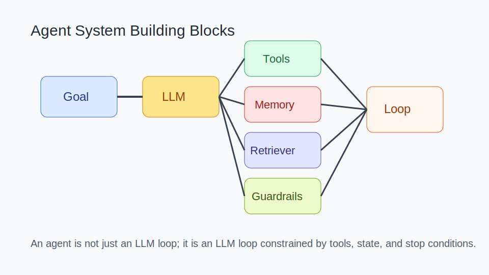
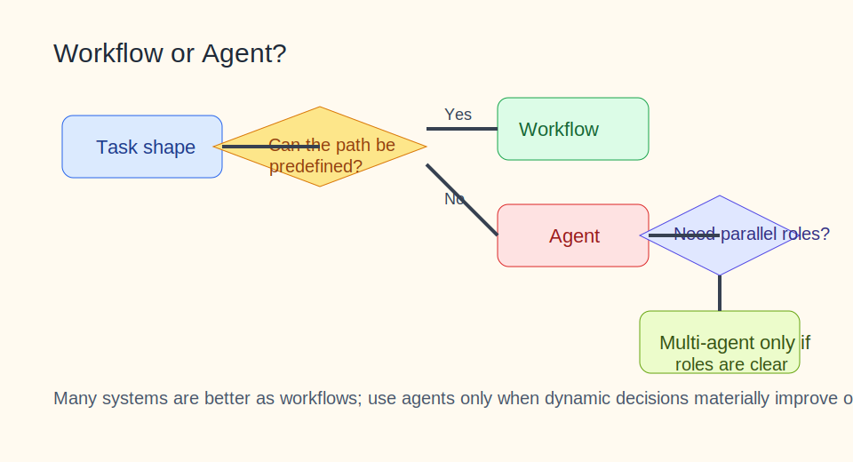

# Agent 知识库

目录

- [阅读路线](#阅读路线)
- [1. 知识介绍](#1-知识介绍)
- [2. 知识原理](#2-知识原理)
- [3. 知识实践](#3-知识实践)
- [4. 相关资源](#4-相关资源)
- [5. 其他重要内容](#5-其他重要内容)

## 阅读路线

这篇文档重点回答三个问题：

- 什么东西才算真正的 Agent；
- 什么时候该做 workflow，什么时候才值得做 agent；
- 如何把 Agent 从“能演示”做成“能落地”。

建议先读 `1. 知识介绍` 和 `2.4 为什么会规划不等于能落地`，再读 `3. 知识实践` 里的决策路径。

## 1. 知识介绍

### 1.1 什么是 Agent

结合主流工程实践，Agent 可以理解为：具备目标驱动、工具调用、环境反馈和多步执行能力的 LLM 系统。它不是单轮问答，也不是单纯函数调用，而是一种带有闭环能力的执行系统。

### 1.2 Agent 与 Workflow 的区别

这是 Agent 讨论里最容易混淆的一点：

- `Workflow`：执行路径由开发者预先写死，模型只在固定节点参与；
- `Agent`：模型在执行中动态决定下一步动作、工具和路径。

因此，不是所有“多轮 + 工具调用”的系统都该叫 Agent。很多实际可用系统，本质上仍然是 workflow。

### 1.3 什么时候适合用 Agent

适合：

- 任务路径不容易完全预定义；
- 需要边执行边判断；
- 能通过环境反馈持续纠偏；
- 接受更高成本换更高完成度。

不适合：

- 单轮 prompt 就能稳定完成；
- 对时延极度敏感；
- 风险极高但缺乏权限边界；
- 没有办法获得真实反馈。

### 1.4 常见误解

- “多代理一定更强”。
  实际上，多代理只有在角色边界清晰时才有净收益。
- “模型更聪明，Agent 就会更稳”。
  没有工具、状态、验证和停止条件，再强的模型也只是连续猜测。
- “先搭框架，再找场景”。
  更稳的顺序是先从任务出发，再决定系统形式。

## 2. 知识原理

### 2.1 Agent 的基础构件

图示说明：Agent 的本质不是一个会思考的 LLM，而是一个被工具、状态和停止机制包围起来的执行闭环。

一个常见 Agent 系统通常包含：

- `Goal`：目标与成功标准；
- `LLM`：理解、规划、决策；
- `Tools`：与外部世界交互；
- `Memory / State`：保存上下文或长期偏好；
- `Retriever`：按需取回信息；
- `Loop`：执行、观察、修正；
- `Guardrails`：做权限、预算、停止条件控制。

### 2.2 常见 Agent 模式

业界常见模式可以分成几类：

- `Prompt chaining`：串联多个固定步骤；
- `Routing`：根据任务类型把请求分流；
- `Parallelization`：多个分支并行处理；
- `Orchestrator-workers`：主代理拆任务给子代理；
- `Autonomous agent`：单代理持续自主决策。

很多团队最后会停在前 3 类，因为它们更容易评估、调试和治理。

### 2.3 Ground Truth 为什么重要

Agent 稳定性的核心不在“会不会说”，而在“能不能被现实纠偏”。常见 ground truth 包括：

- 工具调用结果；
- API 返回值；
- 命令行输出；
- 测试和构建结果；
- 用户确认；
- 外部数据库或业务系统状态。

没有这些真实反馈，Agent 本质上只是在连续生成看似合理的下一步。

### 2.4 为什么会规划不等于能落地

很多 Demo 强调 Agent 会规划，但真正决定落地效果的通常是：

- 工具是否真的可用；
- 状态是否可持久化；
- 失败是否能识别；
- 是否有回退路径；
- 是否存在预算与停止条件。

所以 Agent 系统的核心不是“让模型想很多”，而是“让模型想完以后能被系统约束和验证”。

## 3. 知识实践

### 3.1 从 Prompt 到 Workflow 再到 Agent 的演进路线

推荐路线不是一上来就做 Agent，而是：

1. 先把单轮 prompt 做到可用；
2. 再把固定路径写成 workflow；
3. 只有当固定路径覆盖不了主要价值时，再引入 agent loop；
4. 真有明确分工需求时，再考虑多代理。

这条路线能显著降低早期复杂度。

### 3.2 Workflow 还是 Agent 的决策树

图示说明：大多数系统先问“路径能否预定义”，而不是先问“要不要做多代理”。

可以用以下问题判断：

- 任务路径能否预定义；
- 是否必须动态判断下一步；
- 是否真的需要多个角色并行；
- 环境反馈是否及时且可靠；
- 是否值得支付调试和治理成本。

### 3.3 单代理、多代理、工作流的选择标准

| 方案 | 适用情况 | 主要代价 |
| --- | --- | --- |
| 单轮 prompt | 任务简单、步骤短 | 稳定性有限 |
| Workflow | 路径清晰、重复性高 | 灵活性较低 |
| 单代理 | 需要动态决策 | 调试更难 |
| 多代理 | 角色和子任务边界清晰 | 协调与状态同步成本高 |

### 3.4 典型案例：文档研究助手

一个现实可用的案例通常这样演化：

1. 先做“检索 -> 摘要 -> 引用” workflow；
2. 发现用户问题差异很大，加入 query 改写和路由；
3. 再发现需要动态使用检索、网页读取、总结工具；
4. 最后才引入单代理协调这些动作。

这个案例说明，Agent 往往是最后一层增强，而不是第一层设计。

### 3.5 失败恢复设计

稳定 Agent 至少要考虑：

- 超时怎么处理；
- 工具调用失败如何重试；
- 状态污染时如何重置；
- 预算超限时如何停止；
- 用户打断时如何安全退出。

如果这些没设计，系统越自主，越难排障。

### 3.6 评估指标

不要只看演示效果。更有价值的指标包括：

- 任务完成率；
- 平均时延；
- 单次任务成本；
- 误用工具率；
- 回退成功率；
- 人工接管比例；
- 用户真正可接受的答案比例。

### 3.7 常见误区与失败模式

- 把“多轮调用”误当成 Agent；
- 过早引入重框架，调试困难；
- 工具定义模糊，模型经常误用；
- 没有评估集，只靠主观感觉优化；
- 没有权限边界，高风险动作直接放开。

## 4. 相关资源

### 4.1 官方 / 一手资料

- [Anthropic: Building Effective AI Agents](https://www.anthropic.com/research/building-effective-agents/)
- [Anthropic: Building agents with the Claude Agent SDK](https://www.anthropic.com/engineering/building-agents-with-the-claude-agent-sdk/)

### 4.2 延伸主题

- `tools`：决定 Agent 是否真的能做事；
- `skills`：决定经验如何沉淀为稳定执行套路；
- `mcp`：决定外部能力如何标准化接入；
- `rag`：决定外部知识如何稳定 grounding。

### 4.3 社区资料

- 当前仓库根目录 [README.md](/Users/wangzf/vibe-coding/README.md) 中 `# 4.资料 > Agent`

### 4.4 推荐阅读顺序

1. 先看 effective agents 文章，建立 workflow / agent 区分；
2. 再看 Claude Agent SDK 文章，理解工程化实现；
3. 最后回到你的业务场景，判断是否真的需要 Agent。

## 5. 其他重要内容

### 5.1 与其他主题的关系

- 与 `tools`：没有工具，Agent 只有“看起来能做事”的错觉；
- 与 `mcp`：MCP 帮 Agent 连接外部能力；
- 与 `skills`：Skill 把经验沉淀为更稳定的任务套路；
- 与 `rag`：RAG 提供知识 grounding，Agent 提供行动能力。

### 5.2 常见决策表

| 问题 | 建议 |
| --- | --- |
| 路径可预定义吗 | 优先 workflow |
| 需要动态判断吗 | 才考虑 agent |
| 要不要多代理 | 只有角色边界清晰时才上 |
| 没有评估怎么办 | 先别追求更高自治 |

### 5.3 适用团队规模与治理要求

- 个人开发者：优先从 workflow 起步；
- 小团队：可逐步引入单代理，但要保留人工接管；
- 中大型团队：必须先做权限、审计、预算和回退设计。

### 5.4 演进趋势

未来趋势很可能是：

- 更强的工具编排；
- 更标准化的外部能力接入；
- 更细粒度的权限治理；
- 更成熟的评估与回放机制。

但真正长期稳定的系统，仍然是那些把任务边界、工具边界和失败恢复都写清楚的系统。
