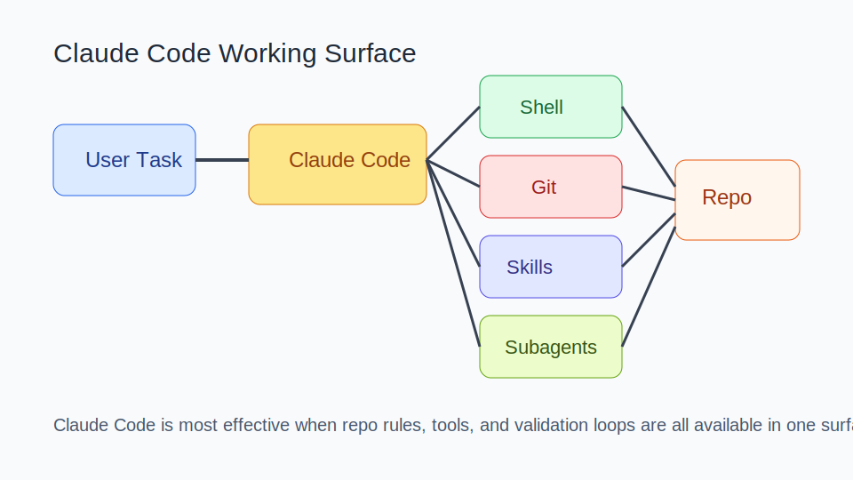
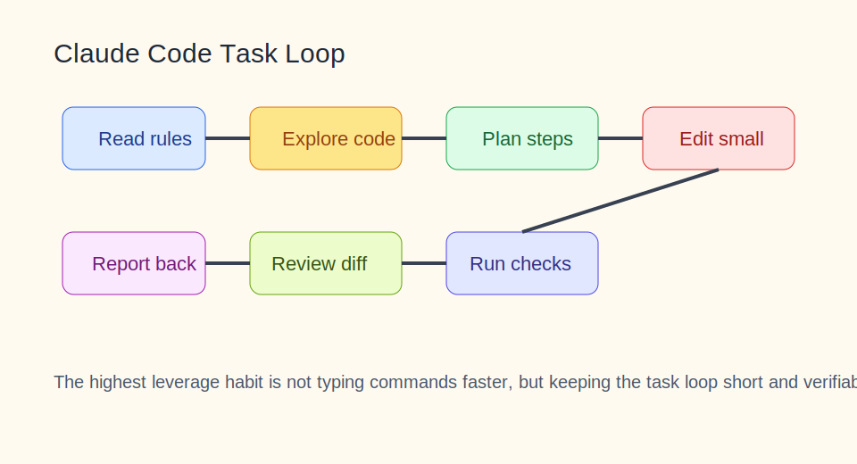

# Claude Code 知识库

<details><summary>目录</summary><p>

- [阅读路线](#阅读路线)
- [1. 知识介绍](#1-知识介绍)
- [2. 知识原理](#2-知识原理)
- [3. 知识实践](#3-知识实践)
- [4. 相关资源](#4-相关资源)
- [5. 其他重要内容](#5-其他重要内容)

</p></details>

## 阅读路线

这篇文档的重点不是“命令大全”，而是 Claude Code 在真实开发流程里为什么有效，以及该如何用它避免上下文腐烂和大改失控。

建议先读 `2.1 核心运行模型` 和 `3.2 典型开发工作流`，再看子代理与技能的使用边界。

## 1. 知识介绍

### 1.1 什么是 Claude Code

Claude Code 是 Anthropic 推出的代理式编程工具。它运行在终端工作面中，强调直接理解代码库、执行命令、处理 Git 流程、调用工具和遵守项目规则。

### 1.2 它解决什么问题

相比普通聊天式编程助手，Claude Code 更适合：

- 跨文件改动；
- 需要终端验证的任务；
- 带工具调用的排障；
- 需要结合仓库规则工作的开发任务。

### 1.3 与传统 AI 编程助手的区别

它的关键差异在于：

- 不是只“生成代码”，而是能围绕任务闭环；
- 不是只看单个文件，而是读项目上下文；
- 不是只对话，而是进入 shell / git / 规则环境；
- 能结合子代理、技能、命令和 hooks 扩展工作流。

## 2. 知识原理

### 2.1 核心运行模型



图示说明：Claude Code 的优势来自“终端、Git、技能、子代理、仓库规则”被放进同一个执行表面，而不是来自一个单点功能。

一个典型任务循环包括：

1. 读取目标和约束；
2. 读取代码库与规则文件；
3. 探索相关文件和命令输出；
4. 规划最小改动路径；
5. 修改并验证；
6. 汇报结果与风险。

### 2.2 为什么规则文件很重要

这一类代理式工具会读取仓库中的人类规则文件，例如 `AGENTS.md`。这些规则决定：

- 哪些目录可以修改；
- 哪些验证命令必须运行；
- 是否允许提交或推送；
- 输出结果需要包含哪些信息。

没有规则文件，Claude Code 往往会退化成“会写代码的聊天机器人”。

### 2.3 子代理、技能、命令、Hook 的关系

- `子代理`：把某个子任务交给更聚焦的角色处理；
- `技能`：把高频套路打包成可复用能力；
- `命令`：把常见动作变成稳定入口；
- `Hook`：在某些阶段自动触发额外行为。

它们共同作用的意义在于：把“每次从零描述”的工作流改造成“系统可复用”的流程。

## 3. 知识实践

### 3.1 入门流程

对第一次使用的人，建议按最小路径走：

1. 安装 Claude Code；
2. 进入项目目录；
3. 让它先读项目与规则；
4. 给一个明确、可验证的小任务；
5. 要求汇报修改点、验证结果和风险。

### 3.2 典型开发工作流



图示说明：最有效的 Claude Code 使用方式，是让任务保持短回路，先读规则、再读代码、再小步修改、再验证。

建议采用以下流程：

1. 先读项目规则和相关文件；
2. 输出任务理解和计划；
3. 先做最小可验证改动；
4. 跑测试、lint 或手动验证；
5. 根据结果决定是否继续扩展。

### 3.3 复杂任务拆解方式

复杂任务更适合拆成：

- 探索阶段：定位代码、依赖、风险；
- 计划阶段：列出步骤和验证方式；
- 实现阶段：一次只完成一段明确改动；
- 收尾阶段：验证、总结、留后续项。

这样做的好处是：

- 容易 review；
- 容易回滚；
- 上下文更稳定；
- 代理更不容易偏航。

### 3.4 什么时候用子代理，什么时候不要用

适合用子代理：

- 子任务边界清晰；
- 可以并行；
- 不同角色确实有不同检查重点。

不适合用子代理：

- 只是一个很小的改动；
- 当前任务的关键上下文高度耦合；
- 角色边界不清，拆了只会增加协调成本。

### 3.5 适合新手的提示模板

```text
请先阅读项目规则和相关模块，再处理下面任务。

任务：
为用户登录失败场景补充错误提示。

上下文：
- src/auth
- tests/auth

约束：
- 不改接口协议
- 补单元测试

验收：
- 登录失败时前端展示可读错误
- 测试通过
- 最终说明改动点与验证结果
```

### 3.6 适合新手的验证模板

```text
完成后请按以下格式汇报：
1. 根因
2. 改动点
3. 运行的验证命令
4. 结果
5. 剩余风险
```

### 3.7 常见失败模式

- 未读规则就直接大改；
- 一个对话塞入多个不相干需求；
- 只追求“生成代码”，不要求验证；
- 简单任务也滥用子代理，导致耗时变长；
- 长对话偏航后不重开任务。

## 4. 相关资源

### 4.1 官方 / 一手资料

- [Claude Code GitHub](https://github.com/anthropics/claude-code)
- [Claude Code Overview](https://code.claude.com/docs/en/overview)
- [Claude Code Best Practices](https://code.claude.com/docs/zh-CN/best-practices)
- [Claude Code Releases](https://github.com/anthropics/claude-code/releases)

### 4.2 课程与配套资料

- [Claude Code in Action](https://anthropic.skilljar.com/claude-code-in-action)
- [Billing Claude Developer Platform](https://platform.claude.com/settings/billing)

### 4.3 社区实践

- 当前仓库根目录 [README.md](/Users/wangzf/vibe-coding/README.md) 中 `# 4.资料 > Claude Code`

### 4.4 推荐阅读顺序

1. 先读 Overview 和 Best Practices；
2. 再看 changelog 和课程；
3. 最后结合真实任务实践，形成自己的规则文件与使用模板。

## 5. 其他重要内容

### 5.1 与其他主题的关系

- 与 `skills`：适合把高频开发套路沉淀成技能；
- 与 `agent`：Claude Code 是 Agent 在编码场景中的产品化形态；
- 与 `tools`：底层 shell、git、脚本和浏览器能力都是关键执行层；
- 与 `mcp`：若需要统一接入外部工具，协议层会越来越重要。

### 5.2 常见决策表

| 问题 | 建议 |
| --- | --- |
| 任务大而模糊 | 先探索和计划，不要直接修改 |
| 要不要用子代理 | 先看子任务边界是否清晰 |
| 需要多少上下文 | 只放必要上下文，避免对话膨胀 |
| 输出怎么要求 | 始终要求验证、风险和后续项 |

### 5.3 演进趋势

Claude Code 这类产品的演进重点通常会在：

- 更好的子代理协作；
- 更好的技能和命令复用；
- 更强的 IDE 与终端一体化；
- 更严格的权限治理和任务审计。

长期有效的使用习惯不会变：目标清晰、小步验证、经验沉淀、规则前置。
