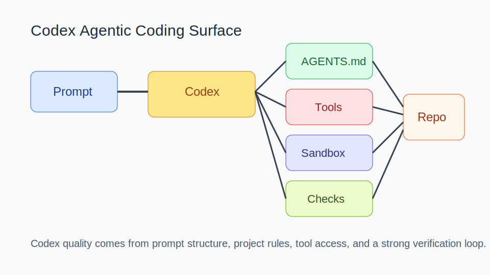
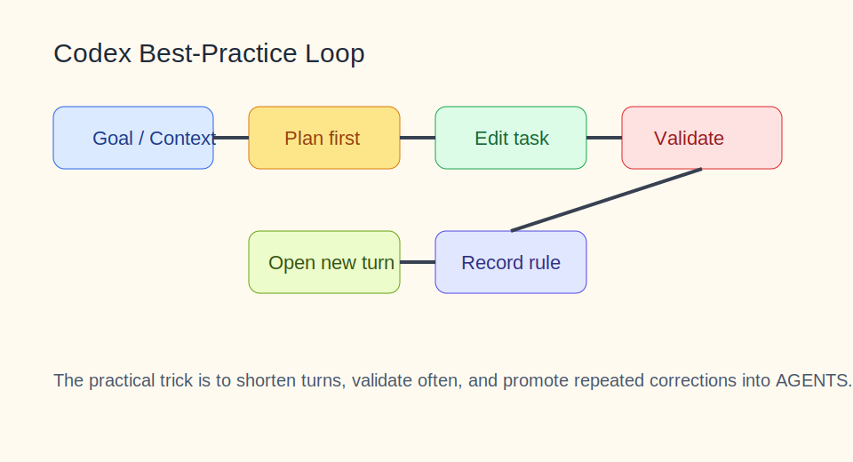

# Codex 知识库

<details><summary>目录</summary><p>

- [阅读路线](#阅读路线)
- [1. 知识介绍](#1-知识介绍)
- [2. 知识原理](#2-知识原理)
- [3. 知识实践](#3-知识实践)
- [4. 相关资源](#4-相关资源)
- [5. 其他重要内容](#5-其他重要内容)

</p></details>

## 阅读路线

这篇文档适合三类读者：

- 想把 Codex 当成日常开发代理的人；
- 想给团队写 `AGENTS.md`、沉淀协作规则的人；
- 想比较 Codex、Claude Code、通用 Agent 开发方式差异的人。

建议阅读顺序：

1. 先读 `1. 知识介绍`，建立 Codex 的产品边界；
2. 再读 `2. 知识原理`，理解为什么规则文件和验证链路是高杠杆位；
3. 最后重点读 `3. 知识实践`，直接拿去改造你的日常工作流。

## 1. 知识介绍

### 1.1 什么是 Codex

本文中的 Codex 指 OpenAI 当前的代理式编码产品与相关模型能力，而不是早期仅指代码生成模型的历史含义。更准确地说，它是一套“模型 + 沙箱执行环境 + 规则读取 + 验证流程”的组合能力。

和传统代码补全工具相比，Codex 的差异不在“更会写代码”这一点上，而在于：

- 能持续围绕一个工程目标进行多步探索；
- 能直接与仓库、终端、规则文件一起工作；
- 能把“计划、改动、验证、汇报”连成一个完整执行回路。

### 1.2 它解决什么问题

Codex 更适合解决以下问题：

- 跨文件、跨命令的工程改动；
- 需要先读仓库、再动手修改的任务；
- 能通过测试、构建或运行结果判定好坏的任务；
- 需要按项目规则工作，而不是随意生成代码的任务。

它不擅长的场景也要明确：

- 目标模糊且没有验收标准；
- 需要产品决策而不是工程执行；
- 没有任何 ground truth 可验证；
- 要求极端低时延、单次补全即可完成的动作。

### 1.3 与相近概念的区别

| 概念 | 核心能力 | 典型局限 |
| --- | --- | --- |
| 代码补全 | 局部生成、单步辅助 | 不擅长长链路任务 |
| ChatGPT 编程对话 | 问答、解释、示例生成 | 默认不直接进入仓库环境 |
| 通用 Agent 框架 | 可自定义多工具、多流程 | 需要自己搭开发工作台 |
| Codex | 面向工程执行的代理式编码表面 | 仍需人类负责目标、审查与最终责任 |

### 1.4 常见误解

- 误解 1：Codex 强在模型本身。
  实际上，模型只是底座，真正决定效果的是规则、环境和验证回路。
- 误解 2：有了 Codex 就不需要软件工程基本功。
  恰恰相反，测试、review、提交点、回滚策略变得更重要。
- 误解 3：任务描述越长越好。
  更高质量的方式是结构化输入，而不是长篇自然语言堆积。

## 2. 知识原理

### 2.1 工作表面与核心组件



图示说明：Codex 的产出质量不是单点模型能力，而是 Prompt、`AGENTS.md`、工具、沙箱和验证环共同作用的结果。

Codex 的基本组件可以拆成五层：

- `任务输入层`：用户给出的目标、上下文、约束、完成条件；
- `规则层`：`AGENTS.md`、项目文档、团队规范；
- `执行层`：代码读取、命令执行、文件修改；
- `环境层`：沙箱、权限、仓库、依赖；
- `验证层`：测试、构建、静态检查、人工验收。

### 2.2 为什么 `AGENTS.md` 是高杠杆位

从官方最佳实践和社区经验看，Codex 成败最明显的分水岭之一，就是规则文件是否清楚。它相当于“长期有效的项目提示词”，决定：

- 哪些文件可以改；
- 哪些改动必须验证；
- 哪些目录禁止触碰；
- 最终结果要按什么格式汇报；
- 是否需要更新 README、是否允许提交等。

一个好的 `AGENTS.md` 不需要写成制度汇编，但至少要包含：

- 项目结构说明；
- 常用构建/测试命令；
- 风格约束；
- 高风险边界；
- 完成标准。

### 2.3 Prompt 结构为什么比“灵感式对话”更稳

最稳定的 Codex 任务输入通常遵循四段式：

1. `Goal`：要改什么；
2. `Context`：相关文件、日志、模块；
3. `Constraints`：禁止项、风格、依赖边界；
4. `Done when`：什么结果算完成。

这么做的价值不在形式，而在于把“目标”和“验收”提前说清，降低代理自己脑补需求的空间。

### 2.4 计划模式与执行模式

对复杂任务，先计划再执行的收益很大。适合先计划的情况包括：

- 改动跨多个模块；
- 需求存在模糊点；
- 回滚成本高；
- 需要先问清假设才能安全动手。

计划阶段应重点产出：

- 影响面；
- 风险点；
- 验证路径；
- 分步改动顺序。

### 2.5 验证链路为什么是代理式编码的底线

Codex 不是“能写完就算完成”，而是“能证明改动有效才算完成”。可靠的验证链通常包括：

- 直接运行测试；
- 跑类型检查或静态检查；
- 跑构建；
- 必要时手动验证关键路径；
- 把结果写回最终汇报。

没有验证，Codex 输出只是候选改动，不是已完成任务。

## 3. 知识实践

### 3.1 从简单使用到团队化使用的分层路径

#### 阶段 A：个人单任务使用

适合第一次上手：

- 只处理一个明确需求；
- 在当前项目里运行；
- 要求给出修改和验证结果；
- 手工 review diff。

#### 阶段 B：项目规则化使用

当你开始频繁使用 Codex 时，应补：

- `AGENTS.md`；
- 统一的测试命令；
- 明确的输出模板；
- 高风险目录和操作边界。

#### 阶段 C：团队化使用

团队场景更关注：

- 可重复的规则文件；
- 与 CI / review 流程结合；
- 明确的审批点；
- 让代理行为可追踪、可审计。

### 3.2 推荐工作流



图示说明：真正稳定的工作流不是“让代理一次做完全部”，而是让任务保持短回路、频繁验证，并把重复纠偏沉淀进规则文件。

建议按以下顺序使用：

1. 先把目标写成结构化提示；
2. 让 Codex 读项目和规则；
3. 对复杂任务先做计划；
4. 一次只做一个明确需求；
5. 每轮都要求验证；
6. 若代理反复犯同一种错，把规则写入 `AGENTS.md`。

### 3.3 最小可复用提示模板

```text
目标：
修复支付模块中的退款状态同步问题。

上下文：
- 相关目录：src/payments、tests/payments
- 相关现象：退款成功后 UI 仍显示处理中

约束：
- 不新增依赖
- 保持现有事件模型
- 必须补测试

完成条件：
- 单元测试通过
- 手动模拟退款后状态正确更新
- 最终说明根因、改动点和验证结果
```

### 3.4 典型案例：修一个跨文件的状态问题

适合 Codex 的案例通常长这样：

- 先读状态流转逻辑；
- 定位是后端事件未发出，还是前端状态未消费；
- 小范围修改两个相关模块；
- 补测试覆盖回归路径；
- 用命令验证；
- 汇报根因和风险。

这个案例说明，Codex 的强项不是“写一个函数”，而是把代码探索、局部修改和验证串起来。

### 3.5 常见失败模式

- 一次塞入多个互不相干任务，导致代理注意力发散；
- 不写约束，结果改出不该改的目录；
- 没有完成条件，代理只能靠猜测判断“是不是做完了”；
- 不验证，只看文字汇报；
- 对上下文已经腐烂的长对话继续硬聊，不重开新任务。

### 3.6 与 Claude Code 的更细粒度对比

| 对比项 | Codex | Claude Code |
| --- | --- | --- |
| 核心定位 | OpenAI 的代理式编码表面 | Anthropic 的代理式编程工作台 |
| 高杠杆规则文件 | `AGENTS.md` | `AGENTS.md` / 项目规则 |
| 使用心智 | 结构化任务 + 强验证 | 终端闭环 + 规则 + 子代理 |
| 实战关键 | 任务拆分、验证、沉淀规则 | 任务拆分、命令面、工具协作 |

实际选型时，不应只看模型偏好，而要看：

- 团队是否已有对应生态；
- 是否需要某一侧更强的 IDE/CLI 工作流；
- 规则、审批、工具接入是否更匹配现有研发流程。

### 3.7 选型与落地建议

- 个人开发者：先把 Codex 用在“改 bug / 补测试 / 梳理模块”上；
- 小团队：先统一规则文件和验证命令，再扩大使用范围；
- 中大型团队：先定义审批点、禁改边界和报告格式，再考虑更广泛接入。

## 4. 相关资源

### 4.1 官方文档

- [OpenAI Codex 文档](https://developers.openai.com/codex)
- [Codex Best Practices](https://developers.openai.com/codex/learn/best-practices)
- [Introducing Codex](https://openai.com/index/introducing-codex/)

### 4.2 源码 / 产品表面 / 配套资料

- OpenAI 开发者文档中的模型与工具说明
- 当前仓库根目录 [README.md](/Users/wangzf/vibe-coding/README.md) 的 `# 4.资料 > Codex`

### 4.3 社区实践

- [codex可以100%正式接管所有编程工作了吗？](https://www.zhihu.com/question/1999136031413384196/answer/2001285971312940749)

### 4.4 推荐阅读顺序

1. 先读官方文档首页，建立产品边界；
2. 再读 Best Practices，理解任务结构和规则文件；
3. 最后看社区文章，吸收工作流与心智模型。

## 5. 其他重要内容

### 5.1 与其他主题的关系

- 与 `agent`：Codex 是 Agent 在软件工程场景中的一种产品化落地；
- 与 `tools`：Codex 的执行能力依赖可用且可验证的工具层；
- 与 `skills`：重复任务可进一步沉淀为稳定套路；
- 与 `mcp`：若工具接入需要标准协议，MCP 是重要扩展方向。

### 5.2 常见决策表

| 问题 | 建议 |
| --- | --- |
| 任务很模糊怎么办 | 先计划，不要直接改 |
| 代理老犯同样的错怎么办 | 把纠偏规则写进 `AGENTS.md` |
| 一轮任务太大怎么办 | 按验证点拆成多轮 |
| 结果看起来对但不放心怎么办 | 回到测试、构建和手动验证 |

### 5.3 演进趋势

可以预期的方向包括：

- 更长链路的代理执行；
- 更强的并行任务处理；
- 更好的规则文件、自动化和工具集成；
- 更高要求的权限治理和审计。

但无论能力怎么演进，最稳定的使用方式仍然是：

- 目标清楚；
- 约束清楚；
- 验证清楚；
- 责任边界清楚。
