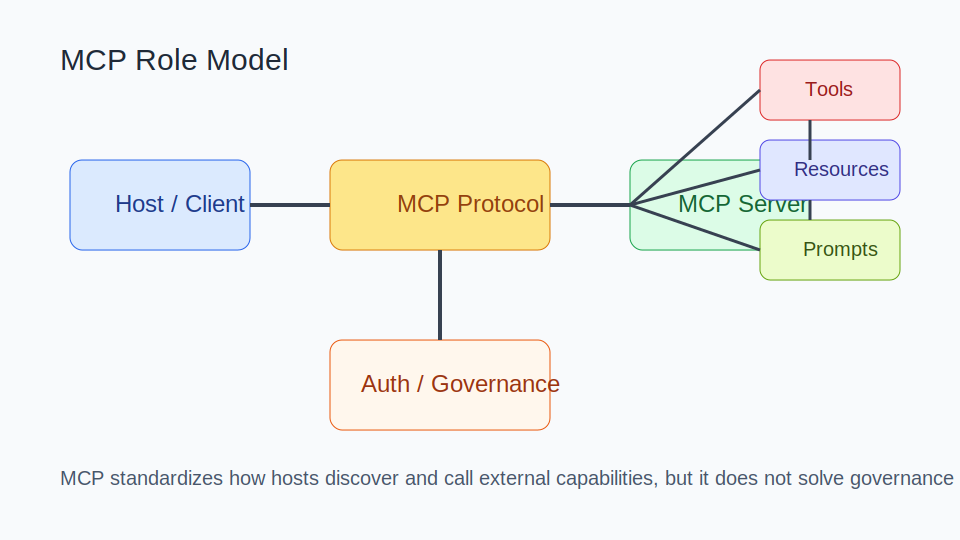
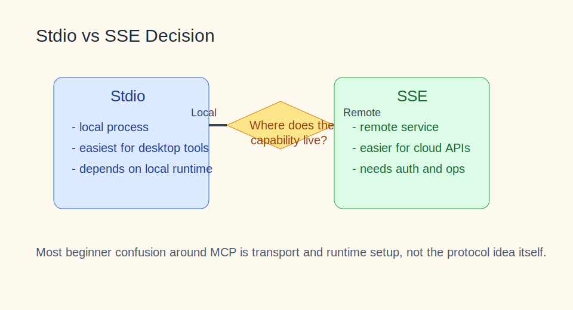

# MCP 知识库

目录

- [阅读路线](#阅读路线)
- [1. 知识介绍](#1-知识介绍)
- [2. 知识原理](#2-知识原理)
- [3. 知识实践](#3-知识实践)
- [4. 相关资源](#4-相关资源)
- [5. 其他重要内容](#5-其他重要内容)

## 阅读路线

如果你第一次接触 MCP，建议先建立一个核心认知：MCP 不是“又一个插件市场”，而是 Agent 与外部能力之间的标准化接口层。读法建议：

1. 先看 `1. 知识介绍`，理解 MCP 到底解决什么问题；
2. 再看 `2. 知识原理`，把 Host / Client / Server / Tool / Resource 这些角色分清；
3. 最后重点读 `3. 知识实践`，尤其是 `Stdio vs SSE` 和“自己写 MCP Server 的设计清单”。

## 1. 知识介绍

### 1.1 什么是 MCP

MCP（Model Context Protocol）是一个开放协议，用来让 AI 应用以统一方式连接外部工具、资源和提示能力。它常被类比为 AI 应用的“USB-C 接口”。

### 1.2 它解决什么问题

在 MCP 出现之前，常见问题是：

- 每个 AI 客户端都要单独接各种工具；
- 同一个工具面向不同客户端要写多套适配；
- 文档、能力声明、调用格式和权限模型缺乏统一。

MCP 想解决的是“工具接入重复开发”和“生态不可复用”的问题。

### 1.3 与 Function Calling 的区别

Function Calling 更像单次调用格式；MCP 更像一整套“能力暴露与发现协议”。它不仅关心函数参数，还关心：

- 服务发现；
- 能力声明；
- 生命周期；
- 资源访问；
- 多种传输方式；
- 安全与治理配合。

### 1.4 常见误解

- 误解 1：MCP 等于安全。
  协议统一并不等于默认安全，最小权限和审计依旧要自己做。
- 误解 2：MCP 只适合开发者。
  实际上，大量普通用户案例都建立在现成 MCP Server 的复用上。
- 误解 3：会写协议就等于能落地。
  生产可用性往往卡在运行时、鉴权、运维和文档质量。

## 2. 知识原理

### 2.1 角色模型

图示说明：MCP 的本体是 Host / Client 与 Server 之间的协议层，它本身不等于任何单个工具或应用。

可以把 MCP 体系拆成：

- `Host / Client`：承载模型并发起调用的一侧；
- `Server`：向外暴露能力的一侧；
- `Tools`：带动作和副作用的能力；
- `Resources`：更偏数据读取；
- `Prompts`：可复用提示模版或引导能力；
- `Governance`：权限、身份、审计、隔离。

### 2.2 能力声明与连接生命周期

一个 MCP 连接通常涉及：

1. 建立连接；
2. 声明能力；
3. 列出工具或资源；
4. 发起调用；
5. 返回结果；
6. 处理错误、重连、关闭。

真正的工程复杂度常常不在协议描述，而在生命周期管理：

- 连接失败怎么处理；
- 版本不兼容怎么办；
- 服务重启或中断如何恢复；
- 高风险操作如何二次确认。

### 2.3 Transport：Stdio 与 SSE

图示说明：多数新手卡点不在“理解协议”，而在“这个 Server 是本地进程还是远程服务”。

`Stdio` 更适合：

- 本地桌面工具；
- 文件系统；
- IDE / CLI 协同；
- 快速本地接入。

`SSE` 更适合：

- 云端 API；
- 远程业务系统；
- 多端共享的在线服务；
- 需要中心化部署和鉴权的场景。

### 2.4 工具、资源、提示的边界

设计 MCP Server 时最好把三类能力分开：

- `Tool`：会做事，可能有副作用；
- `Resource`：提供数据或上下文；
- `Prompt`：提供任务引导结构。

如果把它们混在一起，模型更容易误用，用户也更难理解能力边界。

## 3. 知识实践

### 3.1 两种常见落地方式

#### 路径 A：接现成 MCP Server

适合大多数用户：

- 用支持 MCP 的客户端；
- 导入一个现成 Server；
- 配置环境变量或运行命令；
- 测试工具发现与调用；
- 再逐步扩展更多 Server。

#### 路径 B：自己写 MCP Server

适合把业务系统或团队内部工具暴露给 Agent：

- 报表查询；
- 内部知识库；
- 工单或审批系统；
- DevOps 平台能力。

### 3.2 自己写 MCP Server 的设计清单

在开写之前，先明确：

- 要暴露哪些能力；
- 哪些是只读，哪些是写操作；
- 参数如何设计得清晰且稳定；
- 失败时返回什么结构；
- 需要哪些鉴权信息；
- 是否需要审计和审批。

一个好 Server 的特征通常是：

- 能力边界窄而清晰；
- 返回值结构稳定；
- 文档和示例与真实行为一致；
- 不把太多高风险动作暴露给模型。

### 3.3 典型案例对照

#### 普通用户案例

比如“让 AI 去地图里找咖啡馆”或“接 Obsidian、Figma、文件系统”，重点价值是：

- 用户用自然语言完成跨软件动作；
- 减少手动切换和复制粘贴；
- 通过现成生态快速接能力。

#### 工程实现案例

比如“把公司报表系统接入 Agent”，重点价值是：

- 统一协议；
- 多个客户端复用同一个能力层；
- 明确权限、审计和输入输出约束。

### 3.4 常见坑

- 把 MCP 当成“越多越好”的插件广场；
- 文档写得很少，导致模型不会正确调用；
- Tool 和 Resource 边界不清；
- 忽略本地运行时依赖，Stdio 根本起不来；
- 高风险写操作没有审批或身份隔离。

### 3.5 与 Agent、Tool、Skill 的协同方式

- `Tool` 是能力本体；
- `MCP` 是把能力标准化暴露出来；
- `Skill` 决定什么时候、按什么流程使用这些能力；
- `Agent` 决定在任务中如何动态选择它们。

所以 MCP 很重要，但它只是能力接入层，不替代任务设计本身。

## 4. 相关资源

### 4.1 官方 / 一手资料

- [What is the Model Context Protocol](https://modelcontextprotocol.io/docs/getting-started/intro)
- [Anthropic: Introducing the Model Context Protocol](https://www.anthropic.com/news/model-context-protocol)
- [Anthropic MCP 文档入口](https://docs.anthropic.com/en/docs/mcp)

### 4.2 生态与实现参考

- [Smithery](https://smithery.ai)
- [MCP Servers](https://mcp.so)
- [魔搭 MCP 广场](https://www.modelscope.cn/mcp)
- [Dive](https://github.com/OpenAgentPlatform/Dive)
- [Baidu Maps MCP 示例](https://github.com/baidu-maps/mcp/blob/main/src/baidu-map/python/src/mcp_server_baidu_maps/map.py)

### 4.3 中文入门材料

- [MCP Chinese Getting Started Guide](https://github.com/liaokongVFX/MCP-Chinese-Getting-Started-Guide)
- 当前仓库根目录 [README.md](/Users/wangzf/vibe-coding/README.md) 中 `# 4.资料 > MCP`

### 4.4 推荐阅读顺序

1. 先看官方介绍，理解角色模型；
2. 再看 transport 和生命周期；
3. 然后接一个现成 Server；
4. 最后才考虑自己写 Server。

## 5. 其他重要内容

### 5.1 与其他主题的关系

- 与 `tools`：MCP 让工具更标准化；
- 与 `agent`：Agent 借 MCP 接到外部世界；
- 与 `skills`：Skill 可以规定如何组合和触发 MCP 能力；
- 与 `openclaw`、`claude_code`、`codex`：这些宿主都可能通过协议方式扩展工具层。

### 5.2 常见决策表

| 问题 | 建议 |
| --- | --- |
| 本地工具还是云端能力 | 先判断 Stdio 还是 SSE |
| 能力是读取还是操作 | 分清 Resource 和 Tool |
| 高风险写操作怎么办 | 加鉴权、审批、审计 |
| 要不要自己写 Server | 先看现成生态是否已覆盖 |

### 5.3 资料层级说明

围绕 MCP 的资料可以按四层看：

- 官方协议与文档：定义角色和边界；
- 源码与示例：告诉你真实调用形态；
- 聚合站点：帮助发现生态；
- 社区教程：帮助把抽象概念转成具体配置与案例。

### 5.4 演进趋势

后续演进方向大概率集中在：

- 更成熟的生态发现；
- 更统一的权限和身份模型；
- 更好的调试与观测工具；
- 更丰富的宿主接入方式。
