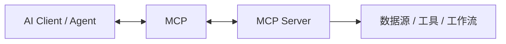

# MCP 知识库

MCP（Model Context Protocol）已经成为 Agent 生态里非常关键的“通用接口层”。如果把 Skill 理解为“任务能力包”，那么 MCP 更像“标准化工具与数据连接协议”。

## 1. 知识介绍

### 1.1 什么是 MCP

根据官方文档，MCP 是一个开源标准，用于让 AI 应用连接外部系统。它可以把数据源、工具、工作流等以统一方式暴露给 Claude、ChatGPT 等 AI 应用。

官方常用比喻是：MCP 像 AI 应用的 USB-C 接口。

### 1.2 MCP 解决什么问题

在 MCP 之前，不同 AI 应用接不同工具常常要各写一套集成逻辑。MCP 试图解决：

- 工具接入重复开发；
- 不同客户端之间协议不统一；
- 外部系统和模型之间的连接难以复用。

### 1.3 适用场景

- 让 AI 访问数据库、文件、搜索、代码库、业务系统；
- 统一构建可复用工具生态；
- 让同一个服务被多个 AI 客户端接入；
- 为 Agent 提供更标准、更可治理的外部能力层。

## 2. 知识原理

### 2.1 基本架构

MCP 体系通常包含两侧：

- `Client`：AI 应用或代理宿主；
- `Server`：向外暴露数据、工具、资源的服务。

简化理解如下：

### 2.2 MCP 为什么重要

官方文档强调的价值主要有三类：

- 对开发者：降低开发复杂度与重复集成成本；
- 对 AI 应用：更容易获取工具与数据生态；
- 对终端用户：获得更强、可执行、可接入数据的助手。

### 2.3 MCP 与传统 Function Calling 的区别

Function Calling 更多是“单次接口调用格式”；MCP 更像：

- 一套统一协议；
- 一套客户端/服务端协作方式；
- 一整套资源、工具、连接生命周期与生态发现机制。

### 2.4 生命周期与治理

从官方资料与社区教程看，MCP 真正落地时要关注：

- 服务发现；
- 连接建立；
- 能力声明；
- 权限与身份；
- 调用与返回；
- 失败恢复与安全治理。

协议本身只解决一部分问题，真正的生产可用性还依赖 host、安全和运维能力。

## 3. 知识实践

### 3.1 两类常见实践

#### 场景 A：用现成 MCP Server

适合快速接入常用工具：

- 文件系统；
- GitHub；
- 数据库；
- 地图、检索、文档平台等。

#### 场景 B：自己写 MCP Server

适合把业务系统或团队内部工具暴露给 Agent：

- 报表查询；
- 工单流转；
- 内部知识库；
- DevOps / 平台能力。

### 3.2 落地步骤建议

1. 明确要开放哪些能力；
2. 先设计资源边界与权限模型；
3. 再设计 server 的输入输出；
4. 在本地 host 中联调；
5. 做审计、错误处理与限权。

### 3.3 最佳实践

- 一个 MCP Server 只暴露一组强相关能力；
- 把只读和高风险写操作区分开；
- 输入参数尽量清晰、稳定、可验证；
- 对副作用操作增加审批或确认；
- 文档和示例必须与实际行为一致。

### 3.4 常见坑

- 把 MCP 当成“万能插件市场”，忽视权限与审计；
- server 暴露太多宽泛能力，难以治理；
- 文档不足，导致模型不会正确使用工具；
- 忽视连接生命周期与失败恢复。

## 4. 相关资源

### 4.1 官方 / 一手资料

- [MCP 官方介绍](https://modelcontextprotocol.io/docs/getting-started/intro)
- [Anthropic: Introducing the Model Context Protocol](https://www.anthropic.com/news/model-context-protocol)
- [Anthropic MCP 文档入口](https://docs.anthropic.com/en/docs/mcp)
- [MCP Registry / 社区生态](https://modelcontextprotocol.io/)

### 4.2 生态与示例

- [Smithery](https://smithery.ai)
- [MCP Chinese Getting Started Guide](https://github.com/liaokongVFX/MCP-Chinese-Getting-Started-Guide)
- [Dive](https://github.com/OpenAgentPlatform/Dive)
- [Baidu Maps MCP 示例](https://github.com/baidu-maps/mcp/blob/main/src/baidu-map/python/src/mcp_server_baidu_maps/map.py)

### 4.3 根目录资料入口

- `README.md` 中 `# 4.资料 > MCP`

## 5. 其他重要内容

### 5.1 微信公众号文章提炼

根据你在 `README.md` 中收录的 MCP 微信文章，以及可访问的镜像整理，面向普通用户的 MCP 文章主要强调 4 件事：

- `MCP 最大的价值是统一适配`：它把“模型 x 工具”的双边适配，尽量变成“客户端接协议、服务端按协议暴露能力”的单边适配。
- `对普通用户而言，难点不是理解概念，而是配置环境`：尤其是本地 `stdio` 模式依赖 `uv`、`npx`、Node.js 等命令行环境。
- `教程价值在于案例驱动`：比起抽象协议说明，普通用户更容易通过 Figma、Obsidian、地图、搜索、论文下载等案例理解 MCP 的用法。
- `聚合站点降低了入口门槛`：如 Smithery、mcp.so 之类站点让用户更容易发现服务并生成导入配置。

### 5.2 Stdio 与 SSE 的实践差异

公众号入门文章普遍会把 MCP 分成两类：

- `Stdio`：本地启动进程，适合文件系统、本地软件、本地 IDE 协同；
- `SSE`：远程服务形式，适合在线 API、云端应用、账户类服务。

这一区分对实践特别重要，因为它直接决定：

- 部署位置；
- 密钥管理方式；
- 调试路径；
- 客户端的导入配置方式。

### 5.3 普通用户视角下最有效的入门路径

综合这些教程，一个相对稳妥的入门顺序是：

1. 先理解 MCP 是“给模型接工具的统一接口”；
2. 先在支持 MCP 的客户端里接一个现成服务；
3. 再学会看配置项、环境变量和命令；
4. 最后才考虑自己写或二次封装 MCP Server。

这比一开始就从协议源码读起更容易建立正确心智模型。

### 5.4 文章案例背后真正重要的能力

那些“高德地图找咖啡馆”“Figma 转网页”“Obsidian AI 知识库”“论文下载”的案例，本质上展示的是：

- Agent 可以访问外部数据源；
- Agent 可以把多个工具串成工作流；
- 用户用自然语言调用，而不是手工在多个软件间切换。

所以案例的价值不只在“好玩”，而在于它说明了 MCP 对 Agent 行动空间的扩展。

### 5.5 为什么 MCP 会成为 Agent 时代的重要基础设施

因为 Agent 想真正“做事”，必须稳定连接外部世界。MCP 提供的是：

- 标准化接入；
- 跨客户端复用；
- 更大的工具生态；
- 更清晰的治理边界。

### 5.6 MCP 不等于安全

协议统一并不等于默认安全。生产环境仍需关注：

- 身份与鉴权；
- 最小权限；
- 审计日志；
- 敏感数据脱敏；
- 高风险动作审批。

### 5.7 参考来源

- 官方：Model Context Protocol 文档 / Anthropic 公告
- 社区：根目录 `README.md` 中列出的 MCP 教程、案例与生态站点
- 交叉参考：
  - [6000 字+6 个案例：写给普通人的 MCP 入门指南](https://cloud.tencent.com/developer/article/2516345)
  - [6000字+6个案例：写给普通人的MCP入门指南](https://www.53ai.com/news/neirongchuangzuo/2025040829147.html)
