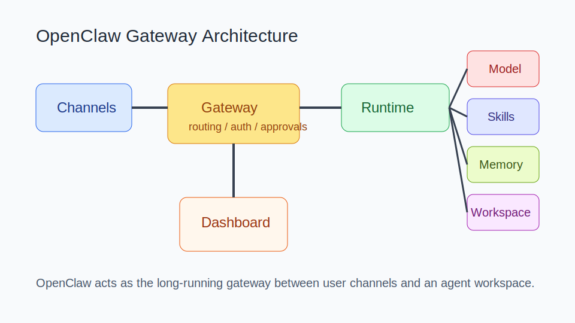
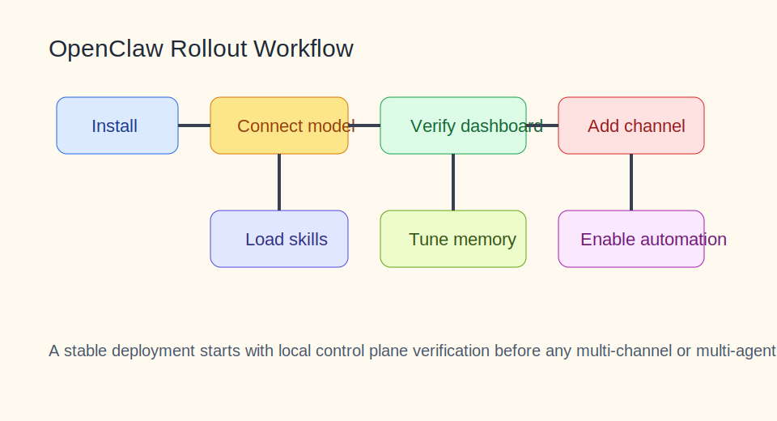

# OpenClaw 知识库

<details><summary>目录</summary><p>

- [阅读路线](#阅读路线)
- [1. 知识介绍](#1-知识介绍)
- [2. 知识原理](#2-知识原理)
- [3. 知识实践](#3-知识实践)
- [4. 相关资源](#4-相关资源)
- [5. 其他重要内容](#5-其他重要内容)

</p></details>

## 阅读路线

OpenClaw 最容易被误解成“又一个聊天工具”，但它真正的价值在于把消息入口、技能、工作区、记忆和代理循环组织成一套长期运行的系统。

建议先读 `2.1 核心架构` 与 `2.3 双层记忆系统`，再看 `3.2 部署与接入顺序`。

## 1. 知识介绍

### 1.1 什么是 OpenClaw

OpenClaw 可以理解为“把 AI Agent 接到消息入口与个人工作流上的自托管网关”。它不是单一模型，也不是单一客户端，而是一套围绕网关、频道、技能、工作区和代理循环组织起来的长期运行系统。

### 1.2 它解决什么问题

OpenClaw 主要解决：

- 让 AI 助手长期在线，而不是只存在于单次网页对话中；
- 把用户熟悉的消息入口接进 Agent；
- 把技能、记忆、工作区和配置留在自己可控的环境中；
- 把多入口、多工作区、多能力的系统组织成一个统一网关。

### 1.3 与相近概念的区别

| 概念 | 侧重点 |
| --- | --- |
| 聊天机器人 | 单个入口、单次交互 |
| Agent SDK | 偏编程框架和编排能力 |
| OpenClaw | 入口、网关、工作区、技能、记忆和长时运行的整套系统 |

### 1.4 常见误解

- 误解 1：装好就能自动干活。
  实际上部署、模型接入、技能治理和安全边界都是前置条件。
- 误解 2：模型本身决定一切。
  很多体验差异来自入口、记忆、工作区和工具层。
- 误解 3：先接很多通道更好。
  初期更应该先把本地控制面和单一入口跑稳。

## 2. 知识原理

### 2.1 核心架构



图示说明：OpenClaw 的核心不是模型壳子，而是 Gateway 这个入口层，它把通道、运行时、技能、记忆和工作区组织在一起。

从官方文档和社区解析看，OpenClaw 的核心组件包括：

- `Gateway`：统一管理会话、路由、认证、审批；
- `Runtime`：执行 Agent 循环；
- `Channels`：Telegram、Discord 等消息入口；
- `Workspace`：长期工作目录与文件记忆；
- `Skills`：能力扩展；
- `Memory`：长期与阶段性记忆；
- `Dashboard`：本地控制面与调试入口。

### 2.2 Gateway、Workspace、Channel 的关系

可以把它理解为：

- Channel 负责把用户消息送进系统；
- Gateway 负责接住消息并决定怎么路由；
- Runtime 负责执行任务；
- Workspace 负责承载持久文件和状态。

这使得 OpenClaw 更像“Agent 入口操作系统”，而不是一个单点脚本。

### 2.3 双层记忆系统

OpenClaw 社区教程反复强调记忆机制，常见理解是：

- `MEMORY.md`：长期、精选、稳定偏好；
- `memory/YYYY-MM-DD.md`：阶段性、每日运行日志；
- `文件即真相`：真正持久的信息尽量落回工作区文件，而不是只停留在模型上下文中。

双层设计的价值在于：

- 可审计；
- 可编辑；
- 可迁移；
- 易于和工作区关联。

同时也带来治理问题：

- 长期记忆容易写入噪声；
- 日志会不断膨胀；
- 陈旧记忆可能误导新任务；
- 群聊和私聊内容容易污染。

## 3. 知识实践

### 3.1 典型部署链路



图示说明：更稳的部署顺序是先安装、接模型、验证控制面，再接消息入口和自动化，而不是一开始就堆很多通道和能力。

建议顺序：

1. 安装 OpenClaw；
2. 跑通本地 Gateway 与 Dashboard；
3. 接入一个模型；
4. 验证最小技能与工作区；
5. 再接一个消息入口；
6. 最后才扩展多工作区、多通道和自动化。

### 3.2 模型接入链路

社区旧文档中最有价值的部分之一，就是提醒你把“模型接入”单独作为一个阶段验证。例如：

```bash
openclaw onboard --auth-choice openai-codex
openclaw config set agents.defaults.model.primary "openai-codex/gpt-5.4"
```

这里的关键不是具体模型名，而是接入顺序：

- 先认证；
- 再设置默认模型；
- 再在 Dashboard 验证模型响应；
- 最后才接技能和消息入口。

### 3.3 从单人助手到多工作区的演进路径

更稳的演进方式通常是：

1. 单人、本地控制面；
2. 单入口、单工作区；
3. 少量高价值技能；
4. 远程通道接入；
5. 多工作区或多角色；
6. 自动化任务和企业化治理。

### 3.4 典型落地案例

最常见的成功案例不是“自动公司”这种大叙事，而是：

- 一个可在 Telegram / Discord 随时私聊的个人助手；
- 有固定 workspace；
- 有少量高价值 skill；
- 能通过消息触发查资料、整理内容、跑固定工作流。

这类案例更接近 OpenClaw 的真实价值。

### 3.5 常见坑

- 一开始接过多消息通道，排障困难；
- 技能、节点、远程能力一起上，复杂度爆炸；
- 没有审批和密钥隔离，风险面过大；
- 把自定义配置直接写进主仓库，升级成本变高。

## 4. 相关资源

### 4.1 官方 / 一手资料

- [OpenClaw 官方文档](https://docs.openclaw.ai/)
- [OpenClaw Getting Started](https://docs.openclaw.ai/start/getting-started)
- [OpenClaw Install](https://docs.openclaw.ai/install)
- [OpenClaw GitHub](https://github.com/openclaw/openclaw)

### 4.2 社区与补充资料

- [OpenClaw Guide：记忆机制](https://yeasy.gitbook.io/openclaw_guide/di-er-bu-fen-jin-jie-shi-yong/06_context_memory/6.3_memory_mechanism)
- [OpenClaw 中文社区：Memory](https://clawd.org.cn/concepts/memory.html)
- 当前仓库根目录 [README.md](/Users/wangzf/vibe-coding/README.md) 中 `# 4.资料 > OpenClaw`

### 4.3 推荐阅读顺序

1. 先看官方 Getting Started；
2. 再看安装和 Dashboard；
3. 再看记忆与工作区；
4. 最后再吸收社区“多助手、多通道”案例。

## 5. 其他重要内容

### 5.1 与其他主题的关系

- 与 `skills`：OpenClaw 把 Skill 作为高价值能力扩展机制；
- 与 `agent`：它是 Agent 的长期运行底座；
- 与 `mcp`：可进一步接标准化外部能力；
- 与 `tools`：底层工具与工作区组织能力会直接影响体验。

### 5.2 常见决策表

| 问题 | 建议 |
| --- | --- |
| 第一步做什么 | 先跑通 Dashboard 和模型 |
| 什么时候接消息通道 | 本地控制面稳定之后 |
| 什么时候加自动化 | 单入口单工作区稳定之后 |
| 记忆怎么治理 | 长期记忆精选化，每日日志定期清理 |

### 5.3 适用场景边界

OpenClaw 特别适合：

- 想把 Agent 接进消息入口；
- 想自托管工作区和记忆；
- 需要长时运行而不是一次性会话。

它不一定是最佳选择的场景：

- 只需要单次网页问答；
- 完全没有部署和治理意愿；
- 只想做极轻量脚本工具。
