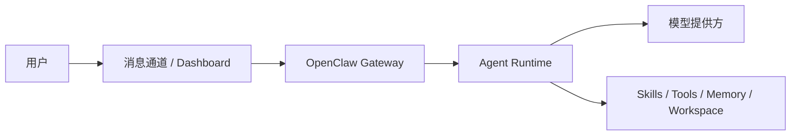

# OpenClaw 知识库

OpenClaw 可以理解为“把 AI Agent 接到聊天入口与个人工作流上的自托管网关”。它不是单一模型，也不是单一客户端，而是一套围绕网关、频道、技能、工作区与代理循环组织起来的个人 AI 助手系统。

## 1. 知识介绍

### 1.1 什么是 OpenClaw

根据官方文档，OpenClaw 是一个自托管、多平台、多消息通道的 AI 助手网关。你可以把它接到 WhatsApp、Telegram、Discord、iMessage 等入口，再把底层模型接到 OpenAI、Anthropic 或自定义兼容接口。

它的目标不是“做一个聊天网页”，而是：

- 让 AI 助手长期在线；
- 让用户在熟悉的通信渠道中调用 Agent；
- 把技能、记忆、工作区、审批、安全控制放在自己可控的环境里。

### 1.2 适用场景

- 想把 AI 助手接入微信/Telegram/Discord 等消息入口的个人或团队；
- 希望代理长期运行，而不是一次性问答；
- 需要自托管、保留本地技能、配置、记忆与工作区；
- 想把“消息入口 + 工具调用 + 自动任务 + 审批”统一起来。

### 1.3 与相近概念的区别

| 概念 | 侧重点 |
| --- | --- |
| 大模型应用 | 主要是单次对话或网页交互 |
| Agent 框架 | 更偏 SDK / 编排层 |
| OpenClaw | 更偏“用户入口 + 网关 + 工作区 + 技能 + 长时运行”整套产品化系统 |

## 2. 知识原理

### 2.1 核心架构

从 OpenClaw 官方仓库与文档看，它的核心是 `Gateway`：

- 统一管理会话、路由、频道连接；
- 将消息通道与 agent runtime 解耦；
- 提供本地 Dashboard / Control UI；
- 负责技能加载、节点联动、审批与配置。

可以用下面的视角理解：

### 2.2 工作区与技能

OpenClaw 把大量个性化配置放到仓库外部或用户目录中，核心目的是：

- 升级主程序时减少定制冲突；
- 把“平台能力”和“用户定制能力”拆开；
- 让同一套网关支持多个 agent workspace。

技能系统兼容 AgentSkills 风格：一个 skill 通常是一个目录，核心文件是 `SKILL.md`。

### 2.3 多通道与多代理

OpenClaw 的一个关键点是“入口与代理分离”：

- 同一个网关可以接多个消息通道；
- 同一个系统可以有不同 workspace / agent；
- 技能按优先级、工作区、共享目录、插件目录叠加加载。

这意味着它更像“代理操作系统的入口层”，而不是一个单点脚本。

## 3. 知识实践

### 3.1 快速开始

官方推荐流程：

1. 安装 OpenClaw；
2. 运行 `openclaw onboard --install-daemon`；
3. 检查 `openclaw gateway status`；
4. 通过 `openclaw dashboard` 打开控制界面。

### 3.2 常见落地路径

#### 路径 A：先跑通本地 Dashboard

适合第一次接触 OpenClaw：

- 先不接消息通道；
- 直接在控制界面验证模型、技能、工作区是否正常；
- 跑通后再接 Telegram / Discord 等外部入口。

#### 路径 B：做“随时可 DM 的个人助手”

典型能力组合：

- 远程消息入口；
- 本地或云端模型；
- skills + memory + workspace；
- 必要时加 cron / webhook / remote node。

### 3.3 最佳实践

- 先把“网关能跑 + 控制面能开 + 模型能响应”单独验证；
- 初期只接 1 个消息通道，避免多入口一起排错；
- 技能尽量围绕具体任务设计，不要写成抽象口号；
- 自定义内容尽量放到 `workspace` 或用户目录，降低升级冲突。

### 3.4 常见风险

- 把 OpenClaw 当成“只要装好就能自动干活”的黑盒；
- 过早引入过多技能、节点、远程接入，排障困难；
- 没有设置审批、沙箱、密钥隔离，导致风险面扩大；
- 工作区和配置直接混改主仓库，升级成本变高。

## 4. 相关资源

### 4.1 官方 / 一手资料

- [OpenClaw 官方文档](https://docs.openclaw.ai/)
- [OpenClaw Getting Started](https://docs.openclaw.ai/start/getting-started)
- [OpenClaw Install](https://docs.openclaw.ai/install)
- [OpenClaw GitHub](https://github.com/openclaw/openclaw)

### 4.2 根目录资料入口

- `README.md` 中 `# 4.资料 > OpenClaw`

## 5. 其他重要内容

### 5.1 微信公众号文章提炼

结合 `README.md` 中收录的 OpenClaw 微信文章，以及可交叉验证的社区镜像与官方资料，可以把这些文章的共识归纳为 4 条主线：

- `OpenClaw 不只是模型壳子`：很多文章反复强调，真正决定体验的是网关、消息入口、技能、工作区、审批和记忆，而不只是底层模型本身。
- `部署是第一道门槛`：社区教程大量篇幅放在安装、模型接入、消息平台接入和本地网络环境配置上，说明 OpenClaw 的价值建立在“先能稳定跑起来”。
- `长期运行能力是差异点`：相比单轮聊天工具，OpenClaw 的优势在于常驻、持续接收消息、记忆状态和串联工作流。
- `多智能体公司化叙事的前提是工程化底座`：很多“24 小时自动干活”的案例，本质前提不是更强 prompt，而是把入口、工作区、工具和安全边界组织好。

### 5.2 双层记忆系统的理解

你在资料里列出的“深入理解 OpenClaw 的双源记忆系统”与相关社区解析，可以和官方文档对齐成下面的结构：

- `MEMORY.md`：精选、长期、稳定的偏好与约定；
- `memory/YYYY-MM-DD.md`：日常运行日志、阶段性上下文；
- `文件即真相`：真正持久的记忆落到工作区文件，而不是停留在模型临时上下文里；
- `工具接口检索`：记忆系统通常通过 `memory_search`、`memory_get` 一类接口被上层代理调用。

这套设计的优点是透明、可审计、可手工编辑；缺点是需要治理，否则容易出现：

- 长期记忆写入过多噪声；
- 每日日志不断膨胀；
- 记忆陈旧但没有更新时间；
- 群聊与私聊边界不清导致污染。

### 5.3 社区教程给出的落地顺序

从“入门到精通”“保姆级搭建”“24 小时 AI 团队”这类文章看，比较稳的实践顺序通常是：

1. 先只跑本地控制面与模型接入；
2. 再接一个消息平台；
3. 再引入少量高价值 skill；
4. 再增加自动化、远程节点或多代理协作；
5. 最后才谈企业化部署、安全加固与多工作区隔离。

这也说明 OpenClaw 最容易踩坑的地方不是“不会聊天”，而是系统复杂度增长太快。

### 5.4 适合补充到你的知识库的判断标准

如果后续继续补 OpenClaw 资料，建议优先保留这几类信息：

- 能解释 Gateway、Agent Loop、Memory、Workspace 的；
- 能给出真实配置路径和排障顺序的；
- 能说明哪些能力来自模型、哪些来自 OpenClaw 本身的；
- 能说明“为什么这样设计”的，而不只是截图演示。

### 5.1 为什么很多文章强调“住在哪里比虾本身重要”

这类说法本质是在强调：Agent 的长期效果不只取决于模型本身，更取决于它接入的环境：

- 入口在哪里；
- 工具能不能用；
- 记忆放在哪里；
- 工作区是否可持续；
- 安全审批是否到位。

OpenClaw 的价值，很多时候恰恰在这层“运行环境组织能力”。

### 5.2 与 Skills、MCP、Agent 的关系

- 与 `Skills`：OpenClaw 用技能扩展能力；
- 与 `MCP`：可把更多工具或外部系统以协议方式接入；
- 与 `Agent`：OpenClaw 更像 Agent 的运行底座与入口系统。

### 5.3 参考来源

- 官方：OpenClaw Docs / GitHub
- 社区：根目录 `README.md` 中列出的 OpenClaw 相关文章
- 交叉参考：
  - [OpenClaw Guide：记忆机制](https://yeasy.gitbook.io/openclaw_guide/di-er-bu-fen-jin-jie-shi-yong/06_context_memory/6.3_memory_mechanism)
  - [OpenClaw 中文社区：Memory](https://clawd.org.cn/concepts/memory.html)
