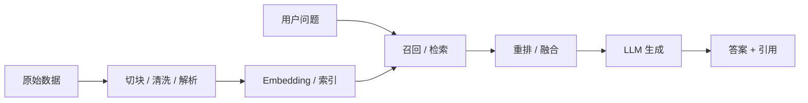

# RAG 知识库

RAG（Retrieval-Augmented Generation）已经从“给模型外挂知识库”的简单说法，发展成一套完整的知识接入、检索、重排、引用、评估与治理体系。本文按“概念 -> 原理 -> 落地 -> 风险”来整理。

## 1. 知识介绍

### 1.1 什么是 RAG

RAG 是把检索系统与大模型结合起来的技术路线：先从外部知识源中检索相关内容，再将检索结果注入模型上下文，帮助模型生成更可靠、更贴近私有知识和最新信息的回答。

### 1.2 RAG 解决什么问题

- 模型参数知识过时；
- 私有数据不在预训练范围内；
- 纯生成容易幻觉；
- 需要引用依据、提高可追溯性。

### 1.3 适用场景

- 企业知识库问答；
- 文档助手；
- 法务、客服、研发文档检索；
- 需要引用来源的生成任务；
- Agent 的外部知识支撑层。

## 2. 知识原理

### 2.1 经典 RAG 链路

一个典型 RAG 流程如下：

### 2.2 核心模块

RAG 的关键模块通常包括：

- 文档解析与清洗；
- Chunking；
- 向量化 / 索引；
- 检索与召回；
- 重排；
- 答案生成；
- 引用与可追溯；
- 评估。

### 2.3 为什么 Chunking 很关键

切块策略直接影响：

- 检索粒度；
- 上下文完整性；
- 噪声比例；
- Token 成本。

例如 Late Chunking、结构化切块、模板切块，都是为了解决“切得太碎丢语义、切得太大召回不准”的矛盾。

### 2.4 RAG 的演进方向

当前 RAG 正在从“向量检索 + 拼上下文”扩展到：

- Hybrid Search；
- 多路召回 + 融合重排；
- GraphRAG；
- Agentic RAG；
- 多模态 RAG；
- 更强调文档理解与引用治理的企业级系统。

## 3. 知识实践

### 3.1 落地顺序建议

1. 先做好数据清洗与文档解析；
2. 再做 chunking 与检索基线；
3. 再加 rerank、hybrid search；
4. 最后再做 agentic / graph / multimodal 增强。

很多 RAG 项目效果差，不是模型差，而是前处理和检索链路没打稳。

### 3.2 常见实践方案

#### 路径 A：知识库问答基线

- 结构化导入文档；
- 做稳定切块；
- 建 embedding + 向量索引；
- 返回答案与引用。

#### 路径 B：企业级 RAG 平台

可参考 RAGFlow 一类系统，重点在：

- 复杂文档解析；
- 可解释 chunking；
- 多数据源接入；
- 引用回溯；
- 与 Agent 结合。

#### 路径 C：GraphRAG / 高级检索

适合需要实体关系、主题社区、全局理解的场景，但复杂度更高，不建议作为第一个版本默认路线。

### 3.3 最佳实践

- 先做检索评估，再优化生成；
- 对“无答案”场景做明确策略；
- 一定返回引用或证据片段；
- 关注延迟、成本、召回率、准确率的平衡；
- 对复杂文档优先做高质量解析，而不是直接粗暴切块。

### 3.4 常见坑

- 只调模型 prompt，不调检索链路；
- 过早追求 GraphRAG，忽视基线质量；
- 没有评估集，优化全靠主观感觉；
- 数据脏、切块乱、索引旧，还期待高质量答案；
- 不区分“检索不到”与“模型不会答”。

## 4. 相关资源

### 4.1 官方 / 一手资料

- [OpenRAG Base](https://openrag.notion.site/Open-RAG-c41b2a4dcdea4527a7c1cd998e763595)
- [RAGFlow](https://ragflow.io)
- [RAGFlow GitHub](https://github.com/infiniflow/ragflow)
- [A Comprehensive Review of Retrieval-Augmented Generation (RAG): Key Challenges and Future Directions](https://arxiv.org/pdf/2410.12837)

### 4.2 代码与案例

- [tiny-graphrag](https://github.com/sdiehl/tiny-graphrag)
- [RAG-Book](https://github.com/Nipi64310/RAG-Book)
- [RAGFlow DeepDoc 中文说明](https://github.com/infiniflow/ragflow/blob/main/deepdoc/README_zh.md)

### 4.3 根目录资料入口

- `README.md` 中 `# 4.资料 > RAG`

## 5. 其他重要内容

### 5.1 微信公众号文章提炼

结合你列出的 RAG 微信文章和公开可访问镜像，可以把社区实践里最有价值的观点提炼为：

- `RAG 的问题通常不在生成端，而在检索端`：切块、召回、重排、引用策略往往比最后的回答 prompt 更决定效果。
- `切块不是简单参数调优，而是语义保持问题`：Late Chunking 这类方法火起来，正是因为传统先切再向量化容易丢上下文。
- `企业落地强调全链路`：真实系统要同时关注离线解析、在线检索、重排、归因、评估和治理，而不是只搭一个向量库。
- `检索模型本身是系统瓶颈之一`：向量召回效果取决于 embedding 模型、数据分块方式、索引结构和 query 改写策略。

### 5.2 Late Chunking 为什么重要

从相关公众号文章与公开介绍可以归纳出 Late Chunking 的核心思路：

- 传统方式：先把文档切成小块，再分别做 embedding；
- Late Chunking：先利用长上下文模型编码整段文本，再在更后阶段按块池化得到块向量。

这样做的好处是：

- 每个 chunk 的向量能感知更完整的上下文；
- 对跨段落引用、长文依赖和局部歧义更友好；
- 在不少检索任务中可提升召回质量，而且不一定需要额外训练。

它也有代价：实现复杂度更高，对长上下文 embedding 模型依赖更强。

### 5.3 RAG 全链路视角

“RAG 全链路关键模块解析”一类文章的价值，在于把 RAG 从单点技巧拉回系统工程。更适合保留到知识库里的要点包括：

- `Query 理解`：意图识别、改写、扩写、结构化查询；
- `检索层`：文档加载、切块、向量化、索引、召回；
- `后处理`：重排、过滤、时间加权、去重；
- `生成层`：上下文拼接、答案生成、拒答策略；
- `归因层`：引用、出处、证据回溯；
- `评估层`：召回率、准确率、延迟、成本、人工评测。

### 5.4 企业落地为什么常提 RAGFlow

从你提供的资料看，RAGFlow 被频繁引用，核心原因不是“又一个框架”，而是它补足了很多生产问题：

- 复杂文档解析；
- DeepDoc 一类文档理解能力；
- 面向知识库系统的工程化组织；
- 更强调引用和可追溯，而不是只返回答案。

### 5.5 RAG 不只是“外挂知识库”

成熟 RAG 系统更像“知识接入层 + 检索系统 + 证据编排层 + 生成层”。真正决定质量的，通常是整条链路，而不是其中单一模块。

### 5.6 RAG 与 Agent 的关系

- RAG 提供知识 grounding；
- Agent 提供任务执行与工具协同；
- 两者结合后，系统更像“会查、会做、会回溯”的工作流。

### 5.7 参考来源

- 官方：OpenRAG / RAGFlow / 论文
- 社区：根目录 `README.md` 中列出的 RAG 实战与教程资料
- 交叉参考：
  - [Late Chunking 介绍](https://www.53ai.com/news/RAG/2024121527513.html)
  - [RAG全链路的关键模块解析](https://blog.csdn.net/qq_19072921/article/details/137494728)
