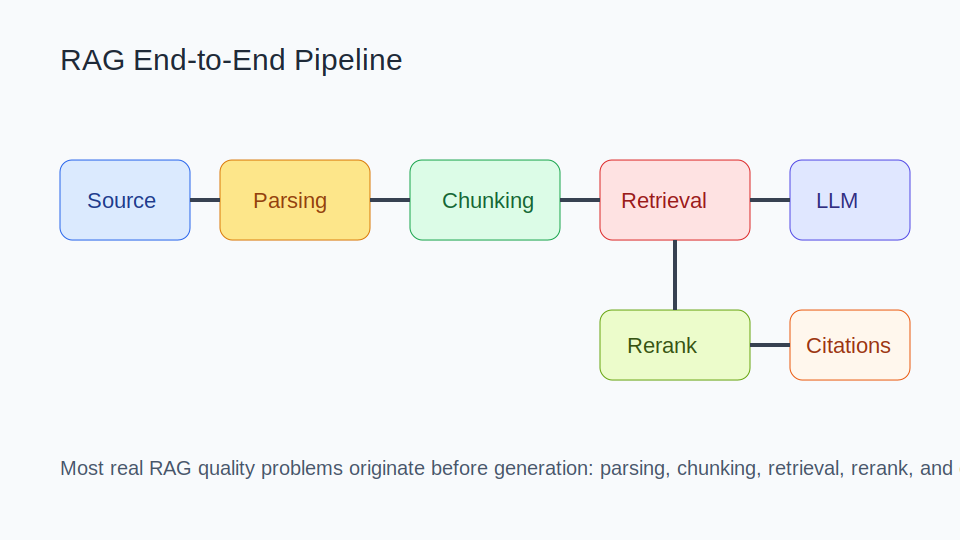
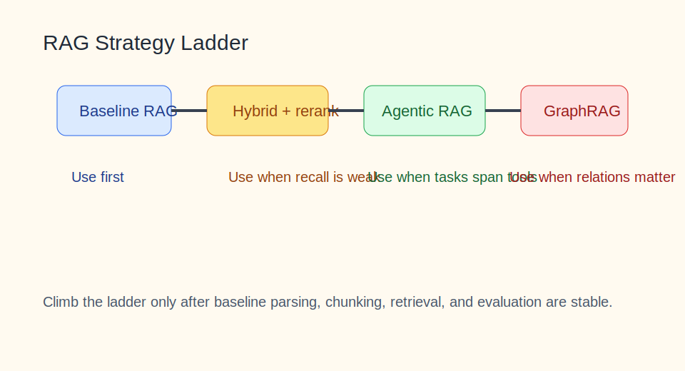

# RAG 知识库

目录

- [阅读路线](#阅读路线)
- [1. 知识介绍](#1-知识介绍)
- [2. 知识原理](#2-知识原理)
- [3. 知识实践](#3-知识实践)
- [4. 相关资源](#4-相关资源)
- [5. 其他重要内容](#5-其他重要内容)

## 阅读路线

如果你已经知道“RAG = 检索增强生成”这句定义，这篇文档真正值得看的部分是：

- 为什么大部分 RAG 问题出在生成前；
- 基础 RAG、Hybrid、Agentic RAG、GraphRAG 该怎么选；
- 怎么做评估，而不是只看演示效果。

建议从 `2.1 全链路架构` 开始，再看 `3.1 落地顺序建议` 和 `3.5 真实排障`。

## 1. 知识介绍

### 1.1 什么是 RAG

RAG（Retrieval-Augmented Generation）是一套把检索系统与大模型结合起来的技术路线。基本过程是：

1. 先从外部知识源中取回相关内容；
2. 再把这些内容注入模型上下文；
3. 用模型生成更可靠、更贴近外部知识的答案。

### 1.2 它解决什么问题

RAG 主要解决：

- 模型参数知识过时；
- 私有数据不在预训练范围内；
- 纯生成容易幻觉；
- 需要引用依据和可追溯性。

### 1.3 RAG 的边界

RAG 不是万能方案。它不一定适合：

- 数据质量很差且无法清洗；
- 任务本质上需要复杂操作而不是检索知识；
- 需要强事务一致性的业务流程；
- 试图用检索掩盖上游文档治理问题的场景。

### 1.4 常见误解

- “RAG 主要靠 prompt 调得好”。
  现实里多数问题发生在解析、切块、召回和重排。
- “只要上向量库就叫做 RAG”。
  没有引用、评估和治理的系统，很难稳定落地。
- “GraphRAG 一定比基础 RAG 更高级更好”。
  复杂度更高，不应在基线没做好时过早引入。

## 2. 知识原理

### 2.1 RAG 全链路架构

图示说明：最常见的质量瓶颈通常出现在解析、切块、召回和证据拼接，而不是最后一句模型回答。

一个完整 RAG 系统通常包含：

- 文档接入；
- 文档解析与清洗；
- 切块；
- 向量化与索引；
- 检索与召回；
- 重排；
- 上下文构造；
- 生成；
- 引用与归因；
- 评估与治理。

### 2.2 为什么 Chunking 是高杠杆位

切块策略直接影响：

- 检索粒度；
- 上下文完整性；
- 噪声比例；
- Token 成本。

切得太碎会丢上下文，切得太大又会召回不准。所谓 Late Chunking、结构化切块、模板切块，本质上都是在平衡“语义完整性”和“检索粒度”。

### 2.3 Retrieval、Rerank 与 Generation 的关系

一个常见误判是把生成端当成主要优化对象。更正确的看法是：

- `Retrieval` 决定找回哪些候选；
- `Rerank` 决定把哪些候选放进上下文；
- `Generation` 决定如何根据证据表达答案。

如果前两步出错，最后一步再强也很难弥补。

### 2.4 基础方案与高级方案的梯度

图示说明：先把基础链路做稳，再逐步引入 Hybrid、Agentic RAG、GraphRAG，通常比直接追求高级方案更稳。

常见梯度如下：

- `基础 RAG`：单路检索 + 简单上下文拼接；
- `Hybrid + rerank`：向量 + 关键词召回，再重排；
- `Agentic RAG`：把检索纳入更动态的工具使用流程；
- `GraphRAG`：引入实体关系、社区结构和图检索。

## 3. 知识实践

### 3.1 落地顺序建议

比起一开始就追求“最先进方案”，更稳的顺序是：

1. 先把文档解析和清洗做好；
2. 建基础切块和检索基线；
3. 再加 hybrid search 和 rerank；
4. 再做引用、拒答和评估；
5. 最后按需要引入 Agentic RAG 或 GraphRAG。

### 3.2 典型基线方案

一个能落地的基线系统通常包括：

- 结构化导入文档；
- 明确切块策略；
- embedding + 索引；
- 检索；
- 回答中带引用；
- 有“查不到就拒答”的策略。

这已经能覆盖大量企业知识库问答需求。

### 3.3 企业级 RAG 重点

企业场景真正难的部分往往是：

- 复杂文档解析；
- 多源数据接入；
- 索引更新；
- 引用回溯；
- 权限边界；
- 离线与在线评估。

这也是为什么 RAGFlow 这类系统常被反复提起，它们关注的是工程化组织，而不是单个检索技巧。

### 3.4 评估指标

RAG 的评估至少应覆盖：

- 检索召回率；
- Top-k 精度；
- 重排质量；
- 答案准确率；
- 引用正确率；
- 无答案场景的拒答质量；
- 时延和成本。

如果只看“回答像不像”，很容易被流畅但错误的答案误导。

### 3.5 真实排障：三类常见问题

#### 问题 A：召回差

常见原因：

- 文档解析坏了；
- 切块不合理；
- embedding 模型不合适；
- query 没有做改写。

#### 问题 B：引用差

表现为答案看似正确，但引用位置不对。根因常在：

- chunk 太大或太脏；
- rerank 不稳定；
- 上下文拼接时丢了源信息。

#### 问题 C：答案看似合理但证据错误

这类问题最危险。通常说明：

- 检索拿回了近似但不正确的证据；
- 模型在“编排表达”时把证据边界混了；
- 系统缺少严格的引用检查。

### 3.6 常见误区

- 只调 prompt，不调检索链路；
- 过早追求 GraphRAG，忽视基线质量；
- 没有评估集，优化全靠主观感觉；
- 数据脏、切块乱、索引旧，还期待高质量答案；
- 不区分“检索不到”与“模型不会答”。

## 4. 相关资源

### 4.1 官方 / 一手资料

- [OpenRAG Base](https://openrag.notion.site/Open-RAG-c41b2a4dcdea4527a7c1cd998e763595)
- [RAGFlow](https://ragflow.io)
- [RAGFlow GitHub](https://github.com/infiniflow/ragflow)
- [A Comprehensive Review of Retrieval-Augmented Generation (RAG): Key Challenges and Future Directions](https://arxiv.org/pdf/2410.12837)

### 4.2 代码与案例

- [tiny-graphrag](https://github.com/sdiehl/tiny-graphrag)
- [RAG-Book](https://github.com/Nipi64310/RAG-Book)
- [RAGFlow DeepDoc 中文说明](https://github.com/infiniflow/ragflow/blob/main/deepdoc/README_zh.md)

### 4.3 社区资料

- 当前仓库根目录 [README.md](/Users/wangzf/vibe-coding/README.md) 中 `# 4.资料 > RAG`

### 4.4 推荐阅读顺序

1. 先看综述论文，建立全链路视角；
2. 再看 RAGFlow 或工程实践，理解生产问题；
3. 最后按你自己的数据类型选择切块、检索和评估方案。

## 5. 其他重要内容

### 5.1 与其他主题的关系

- 与 `agent`：RAG 负责 grounding，Agent 负责行动；
- 与 `tools`：抓取、解析、索引更新都依赖工具层；
- 与 `mcp`：RAG 能力也可以通过标准协议接入宿主；
- 与 `skills`：可把文档整理、评估、索引维护沉淀为技能。

### 5.2 常见决策表

| 问题 | 建议 |
| --- | --- |
| 第一版做什么 | 先做基础 RAG + 引用 |
| 检索效果差怎么办 | 先查解析、切块、embedding、query 改写 |
| 要不要上 GraphRAG | 只有当关系结构是核心价值时 |
| 何时做 Agentic RAG | 当任务不只是回答，而需要检索 + 工具协同 |

### 5.3 风险边界

高风险场景应提高要求：

- 法务、医疗、金融等场景必须严格做引用与审计；
- 私有数据需要权限隔离；
- 索引更新和数据删除要可追踪；
- 不应把“模型说得像”当成正确性的替代品。

### 5.4 演进趋势

RAG 正在朝这些方向演进：

- 更好的复杂文档理解；
- 更强的混合检索与重排；
- 更严格的引用和归因；
- 与 Agent 结合的任务型知识访问；
- 更完整的评估与治理平台。
