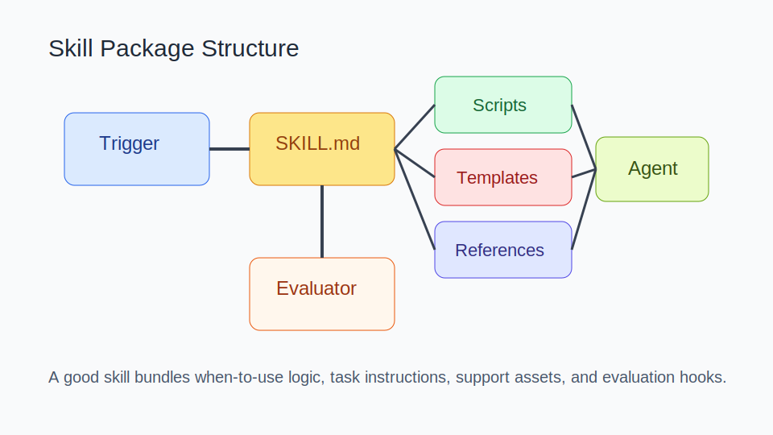
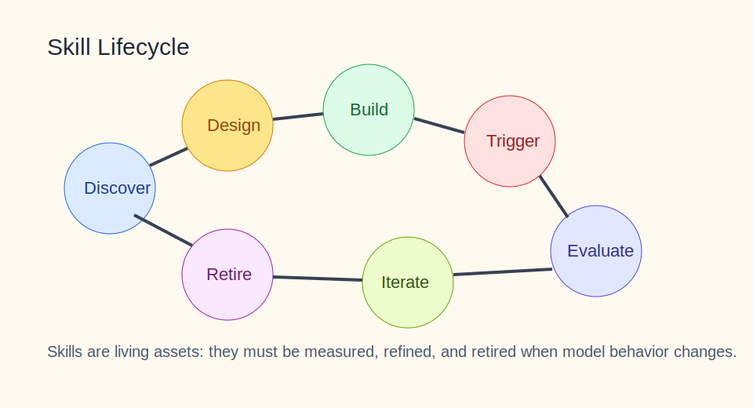

# Skills 知识库

<details><summary>目录</summary><p>

- [阅读路线](#阅读路线)
- [1. 知识介绍](#1-知识介绍)
- [2. 知识原理](#2-知识原理)
- [3. 知识实践](#3-知识实践)
- [4. 相关资源](#4-相关资源)
- [5. 其他重要内容](#5-其他重要内容)

</p></details>

## 阅读路线

如果你想真正理解 Skills，这篇文档最重要的不是“怎么装一个 skill”，而是：

- 什么样的任务值得做成 Skill；
- Skill 为什么是 Agent 时代的高杠杆资产；
- 如何让 Skill 可触发、可评估、可迭代。

建议先读 `1.3 与 Prompt / Tool / MCP 的区别`，再看 `2.2 Skill 生命周期` 和 `3.5 skill-creator 方法论`。

## 1. 知识介绍

### 1.1 什么是 Skill

在 OpenClaw、Claude Code、AgentSkills 一类体系里，Skill 通常是一个目录，核心文件是 `SKILL.md`。它不是“普通知识文档”，而是给 Agent 的可执行说明书。

一个完整 Skill 通常包含：

- 名称与描述；
- 触发条件；
- 操作流程；
- 依赖的脚本、模板、素材、参考文档；
- 失败回退方式。

### 1.2 Skill 解决什么问题

Skill 的核心价值有三类：

- 把重复解释的任务套路沉淀下来；
- 把团队经验转成可复用资产；
- 让模型在更小上下文里拿到更具体的执行方法。

### 1.3 与 Prompt / Tool / MCP 的区别

| 概念 | 核心作用 |
| --- | --- |
| Prompt | 一次性任务指令 |
| Tool | 单个能力接口 |
| MCP | 能力的标准化接入协议 |
| Skill | 将任务经验、工具用法和资源组织成复用单元 |

可以把 Skill 理解为“Prompt 与 Tool 之间的桥”。它不一定自己提供能力，但会告诉 Agent 什么时候、按什么步骤、借助什么能力去做事。

### 1.4 常见误解

- Skill 不是越长越专业；
- Skill 不是知识库条目；
- Skill 不是把一堆工具堆在一起；
- Skill 的关键不在“写了多少”，而在“系统能否在正确时机触发并稳定执行”。

## 2. 知识原理

### 2.1 Skill 包结构



图示说明：一个好的 Skill 不只是 `SKILL.md`，还包括脚本、模板、参考文档和评估思路，形成一个完整任务包。

常见结构包括：

- `SKILL.md`：说明任务目标、触发条件和执行流程；
- `scripts/`：把高确定性的动作做成代码；
- `templates/`：固定输出结构；
- `references/`：补充事实或进阶规则；
- `assets/`：品牌素材、示例、配置片段。

### 2.2 Skill 生命周期



图示说明：Skill 是要持续评估和迭代的资产，而不是一次性写完就结束的 prompt 封装。

一个成熟 Skill 的生命周期通常是：

1. 发现重复任务；
2. 抽象输入、过程和输出；
3. 设计触发描述和执行流程；
4. 构建技能包；
5. 用真实任务测试触发和结果；
6. 根据失败样本迭代；
7. 在不再有效时淘汰或合并。

### 2.3 触发描述为什么最重要

很多 Skill 失败，不是正文不够长，而是描述写得太空。一个好的描述应该明确：

- 何时使用；
- 何时不要使用；
- 任务的输入类型；
- 期望产物。

如果描述只写“这个技能很强大，可以帮你完成很多事情”，系统很难在正确时机触发它。

### 2.4 技能加载与优先级

以 OpenClaw / Claude Code 类体系来看，Skill 往往存在多层来源：

- 内置技能；
- 全局技能目录；
- 项目级技能目录；
- 插件或仓库安装的技能。

因此要关注：

- 同名冲突怎么处理；
- 当前项目能看到哪些技能；
- 哪些技能依赖外部工具或环境变量。

## 3. 知识实践

### 3.1 最小 Skill 模板

```md
---
name: release_notes_writer
description: 当用户需要根据提交记录整理版本说明时使用。不要用于普通文档润色。
---

# Release Notes Writer

## Inputs
- commit log
- scope

## Steps
1. 提取用户可见改动
2. 归类为功能、修复、风险
3. 输出 Markdown 版本说明
```

### 3.2 如何判断一个需求值不值得做成 Skill

以下信号越多，越值得做成 Skill：

- 你已经重复解释过至少 3 次；
- 输出结构比较稳定；
- 经常需要调固定工具或模板；
- 失败模式可总结；
- 这个能力未来还会复用。

不值得做成 Skill 的典型情况：

- 只会做一次；
- 任务边界很模糊；
- 完全依赖临场产品决策；
- 工具和输入每次都变化很大。

### 3.3 安装与使用路径

常见路径包括：

- 项目级：把 skill 放到项目目录的技能路径中；
- 全局级：放到用户技能目录，多个项目共享；
- 通过支持 Skills 的客户端让系统自动安装或导入。

更稳的做法是：

1. 先在隔离环境验证 skill；
2. 再放到项目级目录；
3. 用 3 到 5 个真实任务测试命中率；
4. 通过后再推广到更大范围。

### 3.4 典型案例：多稿合并 Skill

一个高价值的 Skill 往往不是“替你写文章”，而是像“多稿合并”这种稳定流程：

- 输入：多份草稿；
- 目标：保留亮点、去重、统一风格；
- 工具：文档读取、模板、评分标准；
- 输出：结构化成稿与修改说明。

这种任务非常适合 Skill，因为它有明确输入、明确输出和明确评价标准。

### 3.5 `skill-creator` 方法论

`skill-creator` 的价值不只是“帮你生成文件骨架”，而是把 Skill 设计过程变成可迭代流程：

- 先通过问题澄清任务目标；
- 再生成技能结构和描述；
- 再根据样本回放优化触发条件；
- 最后沉淀成真正能复用的技能资产。

这意味着 Skill 已经不只是 prompt 技巧，而是可评估的工程对象。

### 3.6 与 Tool / MCP 的协同模式

常见的协同关系是：

- Tool 负责动作；
- MCP 负责把动作标准化暴露出来；
- Skill 负责规定流程和触发条件；
- Agent 负责在任务中选择和组合它们。

所以 Skill 的价值，常常不在新增能力，而在稳定调用已有能力。

### 3.7 常见失败模式

- 描述太空，命中率低；
- 一个 Skill 想做太多事情；
- 缺少模板和脚本，全靠模型临场发挥；
- 模型能力已变化，但老 Skill 没更新；
- 没有真实任务评估，团队只是“感觉很好”。

## 4. 相关资源

### 4.1 官方 / 一手资料

- [OpenClaw Skills 文档](https://docs.openclaw.ai/skills)
- [OpenClaw Creating Skills](https://docs.openclaw.ai/tools/creating-skills)
- [OpenClaw skills CLI](https://docs.openclaw.ai/cli/skills)

### 4.2 社区实践

- 当前仓库根目录 [README.md](/Users/wangzf/vibe-coding/README.md) 中 `# 4.资料 > Skills`
- [Agent Skills 终极指南](https://zhuanlan.zhihu.com/p/1992272492392380044?share_code=2ubO4NqsZxWB&utm_psn=2000838846183674669)

### 4.3 推荐阅读顺序

1. 先看概念和边界；
2. 再看优秀 Skill 的结构；
3. 再用真实任务回放评估；
4. 最后考虑技能仓库治理。

## 5. 其他重要内容

### 5.1 与其他主题的关系

- 与 `tools`：Skill 经常围绕工具使用方式组织；
- 与 `mcp`：Skill 可以编排通过协议暴露的能力；
- 与 `agent`：Skill 是 Agent 经验显式化的重要方式；
- 与 `claude_code`、`openclaw`：这些宿主通常把 Skill 作为高价值扩展机制。

### 5.2 常见决策表

| 问题 | 建议 |
| --- | --- |
| 一个任务要不要做成 Skill | 先看是否高频、稳定、可评估 |
| Skill 写多长合适 | 以最小必要说明为主，进阶内容外置 |
| 要不要依赖脚本 | 对高确定性动作优先脚本化 |
| 命中率差怎么办 | 先改描述和触发边界，再改正文 |

### 5.3 演进趋势

Skill 正在从“提示词工程副产品”走向：

- 可评估资产；
- 团队知识复用单元；
- 与工具、协议和代理协作的中层抽象。

真正长期有价值的 Skill，不是写得最炫的，而是团队愿意长期维护和复用的。
