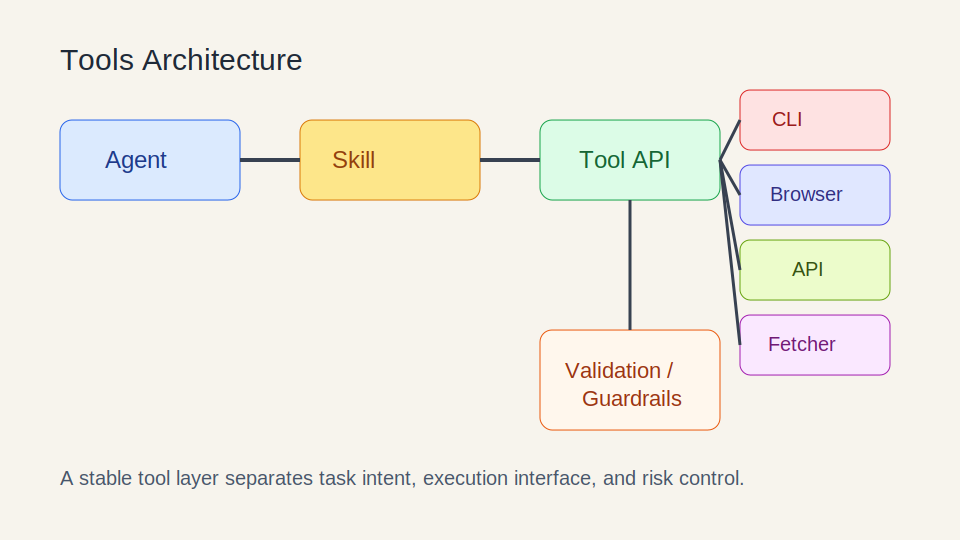
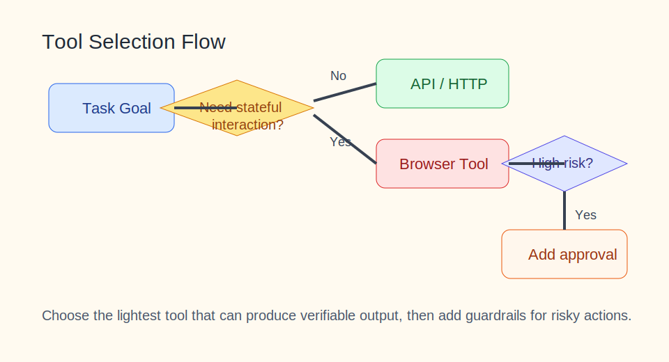

# Tools 知识库

<details><summary>目录</summary><p>

- [阅读路线](#阅读路线)
- [1. 知识介绍](#1-知识介绍)
- [2. 知识原理](#2-知识原理)
- [3. 知识实践](#3-知识实践)
- [4. 相关资源](#4-相关资源)
- [5. 其他重要内容](#5-其他重要内容)

</p></details>

## 阅读路线

这里的 `Tools` 不只是某个抓取库，而是 Agent 真正“动手做事”的能力层。为了让主题更聚焦，这篇文档以 `Scrapling` 为例，但重点放在“如何设计一层对 Agent 友好的工具体系”。

建议先读 `1.2 为什么 Tools 是单独主题`，再读 `2.2 工具分层` 和 `3.4 给 Agent 设计工具接口`。

## 1. 知识介绍

### 1.1 什么是 Tools

在 Agent 语境里，Tool 是暴露给模型或自动化流程调用的外部能力接口，例如：

- 命令行；
- 浏览器；
- 文件系统；
- API；
- 抓取器；
- 数据处理脚本。

### 1.2 为什么 Tools 是单独主题

很多人把 Agent 成败归因于模型，但在真实落地里更常见的瓶颈是工具层：

- 工具边界不清；
- 输入输出不稳定；
- 副作用过强；
- 返回值难以验证；
- 模型不知道何时该用哪个工具。

因此 Tools 更像 Agent 的“行动接口层”，直接决定系统是否能把推理转成可靠动作。

### 1.3 以 Scrapling 为例理解工具价值

`Scrapling` 是一个面向现代 Web 抓取场景的 Python 框架，试图把页面获取、动态渲染、反爬绕过、元素定位和批量爬取整合到一套统一接口里。

和传统 `requests + BeautifulSoup` 相比，它更强调：

- 动态页面获取；
- 浏览器与隐身抓取；
- 会话与反检测；
- 页面变化时的自适应定位。

### 1.4 常见误解

- 工具越多越好；
- 能调用就等于可用；
- 只要有浏览器就能解决所有网页问题；
- Agent 工具只关心功能，不关心权限和副作用。

## 2. 知识原理

### 2.1 工具层架构



图示说明：稳定工具层的关键，是把任务意图、调用接口和风险控制分开，而不是把所有能力堆成一个万能入口。

对 Agent 友好的工具层通常包含：

- `能力接口`：清晰的调用入口；
- `参数模型`：输入规范；
- `结果模型`：结构化输出；
- `风险控制`：审批、限频、只读/写入分层；
- `验证层`：失败处理、结果检查、日志。

### 2.2 工具分层

常见工具可按能力形态分类：

- `CLI 工具`：适合项目检查、构建、脚本执行；
- `Browser 工具`：适合页面交互与动态站点；
- `API 工具`：适合结构化能力和远程系统；
- `Fetcher / Spider 工具`：适合采集与检索；
- `Data 工具`：适合解析、聚合、转换。

分类的意义不是做目录，而是帮助判断：

- 哪种工具最轻量；
- 哪种工具副作用最小；
- 哪种结果最可验证。

### 2.3 一个好工具应满足什么标准

至少应满足：

- 边界清晰；
- 输入稳定；
- 输出结构化；
- 副作用可控；
- 错误可识别；
- 日志可追踪。

如果一个工具只是“勉强能调起来”，但返回模糊文本、权限混乱、失败不透明，那么它对 Agent 来说并不好用。

### 2.4 Scrapling 的能力分层

以 Scrapling 为例，可以把能力拆成：

- `Parser`：高性能解析；
- `Fetcher`：HTTP 获取；
- `DynamicFetcher`：浏览器渲染；
- `StealthyFetcher`：强化反检测；
- `Session`：状态和代理管理；
- `Spider`：并发 crawl、暂停恢复、流式输出。

它很适合作为“采集工具如何做工程化”的案例。

## 3. 知识实践

### 3.1 工具选型流程



图示说明：更稳的策略通常是先用最轻工具拿到可验证结果，再视情况升级到浏览器、代理和更重的采集栈。

推荐顺序：

1. 先定义最小动作；
2. 找最轻量、最结构化的工具；
3. 只有轻量方案不够时再升级；
4. 对高风险动作补审批和日志。

### 3.2 Scrapling 最小示例

```python
from scrapling.fetchers import Fetcher

page = Fetcher.get("https://quotes.toscrape.com/")
quotes = page.css(".quote .text::text").getall()
print(quotes)
```

这个例子最重要的不是语法，而是说明：

- 先用轻量获取；
- 先验证字段能否稳定抽取；
- 再决定是否需要浏览器或更复杂爬取流程。

### 3.3 动态页面与隐身抓取

```python
from scrapling.fetchers import StealthyFetcher

page = StealthyFetcher.fetch(
    "https://example.com",
    headless=True,
    network_idle=True,
)
items = page.css(".product", auto_save=True)
```

适合：

- 页面依赖 JS；
- 对浏览器环境敏感；
- 需要先拿到稳定可访问页面。

### 3.4 给 Agent 设计工具接口的建议

如果工具是给 Agent 直接调用，建议额外保证：

- 参数不要太自由；
- 明确只读和写入能力；
- 返回结构尽量固定；
- 对副作用操作增加确认；
- 把失败信息结构化返回，而不是只吐自然语言。

一个坏工具的典型表现是：

- 能力描述大而空；
- 参数太宽泛；
- 输出夹杂解释文本；
- 模型经常误用。

### 3.5 典型案例：给研究助手做网页抓取层

合理做法通常是：

1. 先用 HTTP 获取看能否拿到正文；
2. 不行再切动态抓取；
3. 对关键字段做多重选择器；
4. 抽样验证；
5. 再把它包装成 Agent 可调用工具。

这样比一开始就用最重浏览器栈更可控。

### 3.6 常见失败模式

- 把浏览器抓取当默认方案；
- 过度依赖自适应定位，不做抽样校验；
- 未区分“抓取失败”和“页面为空”；
- 敏感 cookie 或 token 管理混乱；
- 工具过多但没有统一输入输出规范。

## 4. 相关资源

### 4.1 官方 / 一手资料

- [Scrapling GitHub](https://github.com/D4Vinci/Scrapling)
- [Scrapling 文档](https://scrapling.readthedocs.io/en/latest/)

### 4.2 当前仓库入口

- 根目录 [README.md](/Users/wangzf/vibe-coding/README.md) 中 `# 4.资料 > Tools`

### 4.3 推荐阅读顺序

1. 先理解工具层设计原则；
2. 再看 Scrapling 如何把采集做工程化；
3. 最后回到自己的 Agent 场景，思考哪些能力该工具化、哪些该协议化、哪些该写成 Skill。

## 5. 其他重要内容

### 5.1 与其他主题的关系

- 与 `agent`：工具层决定 Agent 是否真能做事；
- 与 `mcp`：MCP 可以把工具标准化暴露给宿主；
- 与 `skills`：Skill 决定何时和如何组合这些工具；
- 与 `rag`：文档采集、解析、索引更新高度依赖工具层。

### 5.2 常见决策表

| 问题 | 建议 |
| --- | --- |
| 工具选最轻还是最强 | 先选最轻且可验证的 |
| 何时上浏览器 | 静态方案不够时再上 |
| 工具要不要开放写入 | 高风险能力分层开放 |
| 输出怎么设计 | 优先结构化结果 |

### 5.3 风险与合规

- 抓取前确认站点服务条款和 robots；
- 对账号、验证码、个人数据提高审计强度；
- 避免把敏感配置写进仓库；
- 对副作用工具增加审批与日志。
